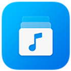

# Discover the Ultimate iPhone Music Player Apps: Evermusic and Beyond

**Writer:** admin  
**Date:** May 5, 2020  
**Updated:** Dec 6, 2024  
**Read Time:** 3 min read

In the realm of smartphone apps, music player apps hold a special place in our hearts. They transform our iPhones into portable jukeboxes, offering us the power to curate our playlists and carry our favorite tunes wherever we go. In this article, we'll explore some of the best iPhone music player apps on the market, with a particular focus on Evermusic's unique features.

## 1. Evermusic: The All-in-One Solution

Let's kick things off with **Evermusic**, a versatile music player app available for both iOS and macOS. Evermusic stands out for its comprehensive features that cater to music enthusiasts of all kinds:

- **Universal Compatibility:** Evermusic supports a wide range of audio formats, including MP3, FLAC, WAV, AAC, and more. This means you can play your music, regardless of the format.

- **Cloud Integration:** Evermusic seamlessly connects to various cloud storage services, such as iCloud Drive, Google Drive, Dropbox, and OneDrive. This feature allows you to stream your music directly from the cloud without clogging up your device's storage.

- **Offline Playback:** Not every location has a stable internet connection, and that's where Evermusic shines. You can download your favorite tracks for offline listening, ensuring your music is always at your fingertips.

- **Playlist Management:** Evermusic makes it easy to create and organize playlists. Whether you want to sort your tracks by artist, album, genre, or mood, this app has you covered.

- **Cross-Platform Sync:** Evermusic offers seamless syncing between iOS and macOS devices. Your playlists and music library stay consistent, no matter which device you're using.

- **Customizable Equalizer:** Fine-tune your listening experience with Evermusic's built-in equalizer, allowing you to adjust the audio to your preference.

## 2. Apple Music: The Native Option

As the default music player for iOS devices, **Apple Music** offers an extensive library of songs and playlists. While it integrates seamlessly with your Apple ecosystem, it's subscription-based, and you'll need to pay for a monthly subscription to access its full features.

**Pros:**

- Extensive music library.
- Integration with Siri.
- Offline listening.
- Curated playlists and radio stations.

**Cons:**

- Requires a subscription for full access.
- Limited cloud integration.

## 3. Spotify: The Streaming Giant

**Spotify** is a popular music streaming service with a robust iPhone app. It offers an enormous library of songs, playlists, and podcasts. Like Apple Music, Spotify also requires a subscription for full access.

**Pros:**

- Extensive library with a vast selection of playlists.
- Cross-device syncing.
- Podcasts and personalized playlists.
- Offline listening.

**Cons:**

- Requires a subscription for unlimited skips and offline listening.
- Limited support for local files.

## 4. VLC for Mobile: The Open-Source Option

**VLC for Mobile** is an open-source multimedia player that supports a wide range of audio and video formats. It's a great choice if you have a diverse media collection and want an app that can handle it all.

**Pros:**

- Wide format support.
- No need for subscriptions.
- Equalizer for audio adjustments.
- Local file playback.

**Cons:**

- The interface may be less user-friendly.
- Limited cloud integration.

## 5. Amazon Music: The Amazon Ecosystem

**Amazon Music** offers a substantial music library with a focus on integrating seamlessly with Amazon Echo devices. While it's primarily a subscription service, it does offer a limited selection of free ad-supported music.

**Pros:**

- Integration with Amazon Echo devices.
- Free tier with ads.
- Offline listening for subscribers.
- Extensive music library.

**Cons:**

- Subscription is required for full access.
- Limited free tier.

## Conclusion: Choosing the Right Music Player for You

The best iPhone music player app for you depends on your specific needs and preferences. If you value versatility, cross-platform syncing, and extensive format support, **Evermusic** stands as an excellent choice. It empowers you to enjoy your music collection, both locally and in the cloud, without sacrificing quality or convenience.

While Apple Music, Spotify, VLC for Mobile, and Amazon Music all have their merits, they may require subscriptions for premium features or offer limited support for various audio formats. Evaluate your priorities, from music library size to cost considerations, and make the choice that best suits your musical lifestyle.

Whether you're a casual listener or a dedicated audiophile, there's an iPhone music player app out there to enhance your listening experience. With Evermusic and other top options, you're sure to find the perfect harmony for your musical journey.

**Tags:** [music](https://www.everappz.com/blog/tags/music), [cloud](https://www.everappz.com/blog/tags/cloud), [streaming](https://www.everappz.com/blog/tags/streaming), [players](https://www.everappz.com/blog/tags/players)