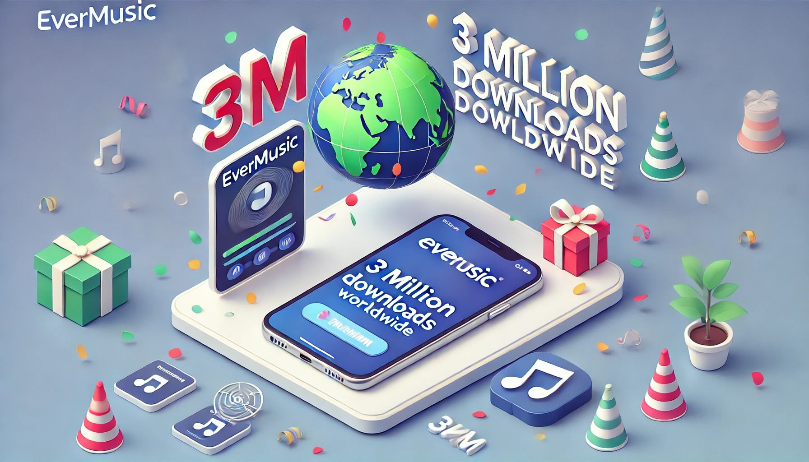
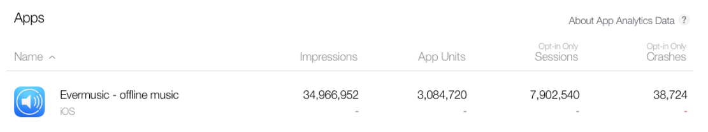

# Evermusic 3 Million Downloads Worldwide

**Writer:** admin  
**Date:** Nov 8, 2017  
**Updated:** Jul 16, 2024  
**Reading Time:** 3 min read

We're thrilled to announce a significant milestone - Evermusic has achieved a whopping 3 million worldwide downloads! Every day, thousands of music enthusiasts worldwide trust Evermusic to listen to their favorite tunes from the cloud and download tracks for offline enjoyment.

We extend a massive thank you to our incredible community for their unwavering support, invaluable feedback, feature requests, and bug reports. Your contributions have played a pivotal role in shaping our app. Countless feature requests were heard, and most were implemented in updates.

Our dedicated team addressed hundreds of reported issues, ensuring a seamless listening experience for you.

For those not yet familiar with Evermusic, let us introduce you to some of its top features, some of which are unique to our app.

At its core, Evermusic aims to help you build your personal cloud music streaming service, seamlessly integrating all your audio sources. Whether it's music stored on your MAC, PC, NAS, iPhone, iPad, or cloud services like Dropbox, Google Drive, OneDrive, and more, Evermusic brings it all together in one app.

**Here's How Evermusic Works:**

**Install Evermusic:** Start by downloading the free Evermusic app from the App Store: [Download Evermusic](https://itunes.apple.com/us/app/evermusic-offline-music-player-cloud-streamer/id885367198?ls=1&mt=8). Connect all your audio sources in one convenient place, and all your discovered tracks will populate your music library.

**Versatile Cloud Services:** Evermusic currently supports popular cloud services like Dropbox, Google Drive, OneDrive, Box, MEGA, Yandex.Disk, MediaFire, MyDrive, pCloud, and HiDrive. You can also connect your computer using the SMB protocol or external WiFi Drive with WebDAV, streaming music directly from these sources.

**Extend Your Storage:** Evermusic even allows you to connect an SD or micro SD card using a lightning card reader. In this scenario, you no longer need to store audio files on your iPhone or iPad. All your music becomes available online, freeing up space for photos and new apps.

**Key Features of Evermusic:**

**All-In-One Audio Player:** With a straightforward user interface, Evermusic offers seven cool themes and support for multiple languages. It supports iOS 8.0 or later and handles the most popular audio formats: mp3, aac, m4a, wav, aiff, m4r. For large FLAC collections or different file formats like OPUS and OGG, we have another app called Flacbox.

**Audiobook Friendly:** Audiobook enthusiasts will find Evermusic indispensable, with features like multiple audio bookmarks, playback speed control (from 0.5x to 2.0x), and media position saving. A sleep timer (from 1 minute to 24 hours) ensures you drift off to your audiobooks without interruption. Additionally, Evermusic supports Repeat, Shuffle, and the unique Repeat Stop feature, which pauses each track at the end. You can also stream your music to Apple TV and Google Chromecast devices.

**Music Downloader:** Even though your music is available online, Evermusic lets you download your favorite tracks, albums, and artists in one tap for offline listening. Evermusic boasts an advanced download manager and player cache. You can select the number of connections available for downloading (up to 20 parallel threads), ensuring fast downloads. The player cache allows you to start listening to music while all your recently played tracks are automatically downloaded.

**Real 10-Band Equalizer:** Evermusic takes audio quality seriously with the best implementation of an audio equalizer. It offers 10 different frequencies and iPod-style presets for popular music genres. Additionally, you can manually adjust equalizer settings and change preamplifier gain from 0 to 2.0 for a personalized listening experience.

**Playlists Manager:** Create and manage custom playlists, change song orders within playlists, and make playlists available offline. Search for tracks within your playlists effortlessly.

**File Manager:** Manage your files on cloud storage within the app, keeping your music library up to date. You can perform basic file operations like rename, move, delete, download, upload, and create new directories. Evermusic also supports the "Open In" feature to send any file to another app.

**ID3 Tags Editor:** Evermusic automatically groups newly added tracks by Artist, Album, or Genre tags and fetches artwork from the web. However, if you encounter corrupted metadata in your files, use the built-in tags editor. If you have issues like corrupted characters or missing information, simply tap the Identify button, and the app will fix metadata encoding and complete the fields automatically.

Evermusic is compatible with iPhone and iPad running iOS 8.0 and later. It's available as a free app, and you can download it from the App Store here: [Get Evermusic](https://itunes.apple.com/us/app/evermusic-offline-music/id885367198?mt=8)

Don't wait any longer to build your personalized streaming service with Evermusic. Download this fantastic free app now and embark on a musical journey like never before!

---

**Tags:** [evermusic](https://www.everappz.com/blog/tags/evermusic), [music](https://www.everappz.com/blog/tags/music), [player](https://www.everappz.com/blog/tags/player), [computer](https://www.everappz.com/blog/tags/computer), [downloader](https://www.everappz.com/blog/tags/downloader), [3million](https://www.everappz.com/blog/tags/3million), [downloads](https://www.everappz.com/blog/tags/downloads), [filemanager](https://www.everappz.com/blog/tags/filemanager)

**Category:** [What's New](https://www.everappz.com/blog/categories/what-s-new)