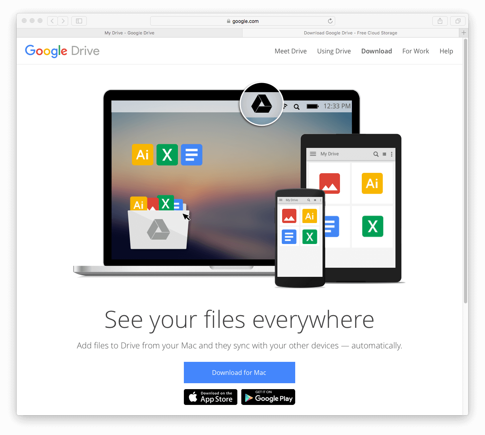
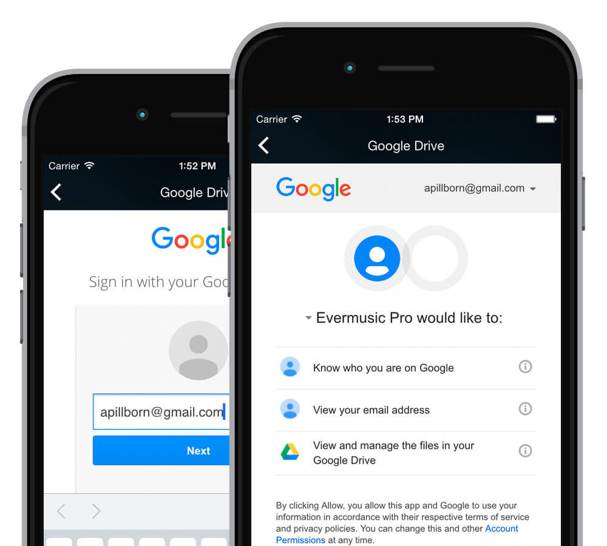

# Evermusic: Stream Your Music from the Cloud and Free Up Space on Your iPhone or iPad

**Writer:** admin  
**Date:** May 26, 2016  
**Updated:** Jul 16, 2024  
**Reading Time:** 2 min read

## Stream Your Music Effortlessly with Evermusic

Do you have a treasure trove of music taking up 50GB, but your iPhone has a mere 32GB of storage? Don't worry, you can reclaim your device's space and enjoy your music directly from the cloud using Evermusic.

## Offline Listening, No Internet Required

Evermusic offers an incredible offline mode, allowing you to download your favorite albums, tracks, genres, artists, and playlists. This means you can groove to your tunes even when you're not connected to the internet.

## Seamless Music Playback

With smart buffering techniques, your music experience is smoother than ever. Enjoy fast track switching and seamless playback, whether your music is in the cloud or on your device.

## Goodbye iTunes Syncing Hassles

Bid farewell to the tedious iTunes synchronization process. Your audio files can be effortlessly uploaded to the cloud from your PC or Mac, just like any other files.

## How to Play Music from Google Drive on Your iPhone

Don't have an account with one of our supported cloud services yet? No problem! Simply visit their website to sign up.

Once you have your cloud service account ready, follow these steps to enjoy your music on Evermusic:

### 1. Connect Your Cloud Account:

You can link any of our supported cloud accounts, including Dropbox, Box, Google Drive, OneDrive, MediaFire, Yandex.Disk, MEGA, SMB, MyDrive, pCloud, HiDrive, and WebDAV.

### 2. Install the Cloud Service Application:

Download and install the cloud service application for Mac or PC as per your choice.

### 3. Upload Your Music:

Follow your cloud service's instructions to upload your music files to the cloud.

### 4. Access Your Music on Evermusic:

Open the Evermusic app.

Open the "Connections" tab, select "Connect a cloud service", and select your cloud service to access your entire music collection.

Enter your credentials, allowing access to the Evermusic app (rest assured, we don't access your files).

### 5. Start Playing:

Open the music folder located in the connected cloud service, tap on any file, and let the music play!

## Bonus Tip: Stream from Your Computer

If you prefer to connect your computer directly, you can use the SMB protocol to stream your music from your Mac or PC. Find step-by-step instructions on how to do this in our guide: [How To Stream Your Music from MAC or PC to iPhone Using SMB](https://www.everappz.com/post/stream-your-music-from-mac-or-pc-to-iphone-using-smb).

With Evermusic, your music is always within reach, no matter where it's stored. Enjoy the freedom of cloud-based music streaming and rediscover your music collection with ease.

---

### Tags

- [audio](https://www.everappz.com/blog/tags/audio)
- [streaming](https://www.everappz.com/blog/tags/streaming)
- [player](https://www.everappz.com/blog/tags/player)
- [mp3](https://www.everappz.com/blog/tags/mp3)
- [downloader](https://www.everappz.com/blog/tags/downloader)
- [account](https://www.everappz.com/blog/tags/account)
- [GoogleDrive](https://www.everappz.com/blog/tags/googledrive)
- [Dropbox](https://www.everappz.com/blog/tags/dropbox)

### Categories

- [How To](https://www.everappz.com/blog/categories/how-to)