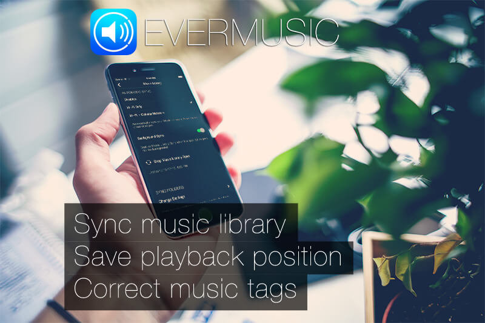
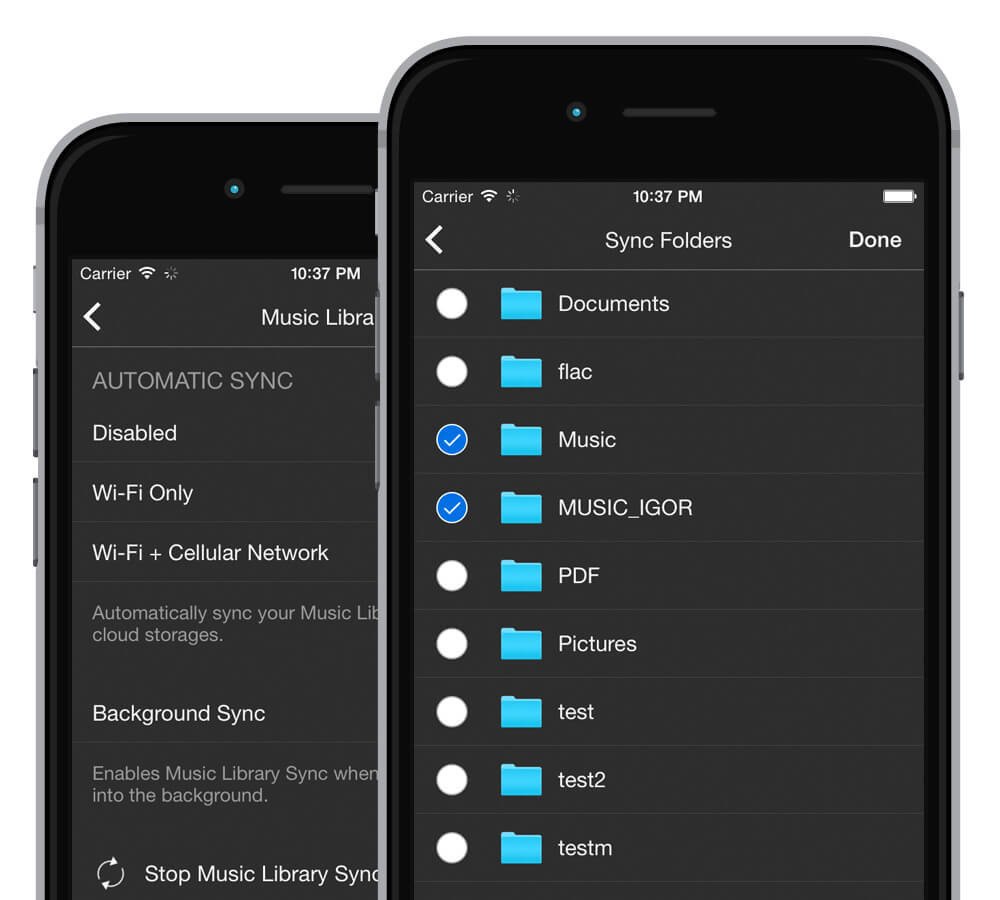
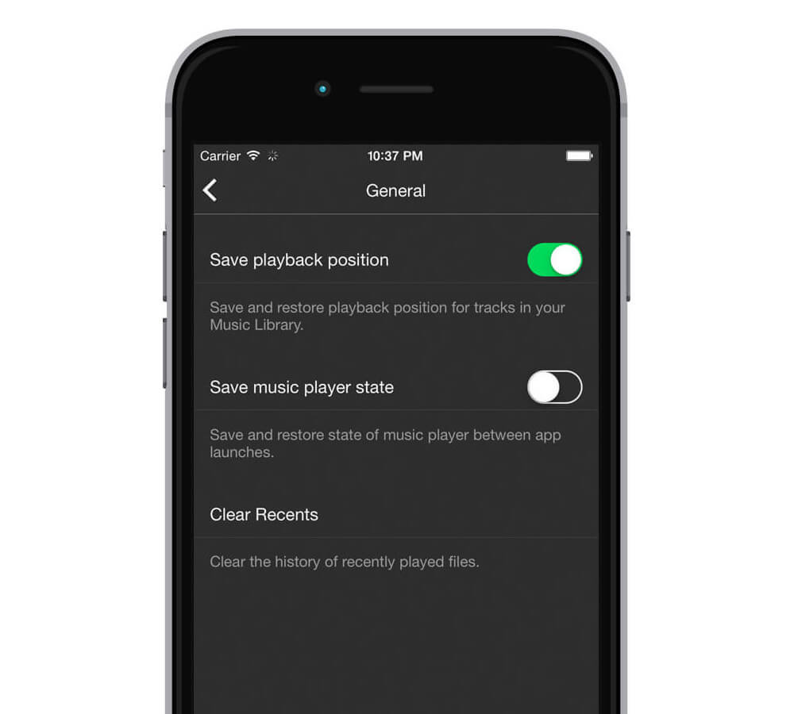
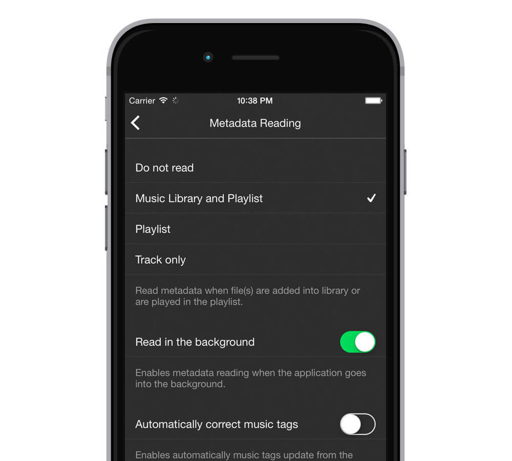
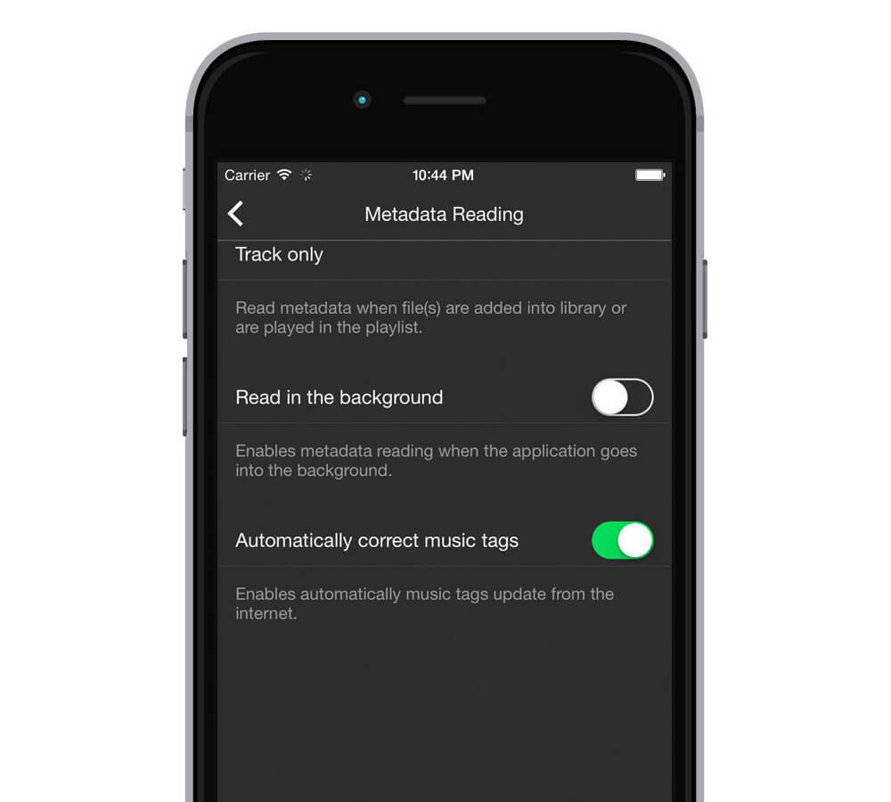

# Evermusic 2.3 – Sync your Music Library, Save playback position, Correct music tags

  
**admin**  
May 26, 2016  
2 min read  

Updated: Jul 16, 2024

## Experience Evermusic's Massive Update – The Ultimate Cloud Music Player

Today, we are thrilled to unveil a colossal update for Evermusic, delivering a wealth of features you've been eagerly awaiting. Evermusic is your compact yet incredibly intelligent cloud music player, allowing seamless streaming from DropBox, Box, OneDrive, Google Drive, Mega, WebDAV, and SMB. If you haven't already, you can download it [here](https://apps.apple.com/us/app/evermusic-cloud-music-player/id885367198).

So, what's under the hood in this version?

### AUTOMATIC SYNC - Your Music, Your Way

No more manual hassle! Our automatic sync feature, inspired by your feedback, is now here. Say goodbye to manually adding or removing tracks when you make changes to your cloud storage. Our sync engine diligently tracks changes and updates your Music Library automatically. Plus, you have the flexibility to choose which folders sync and let it happen effortlessly in the background.

### SAVE PLAYBACK POSITION - Perfect for Audiobooks and Lectures

Have a penchant for audiobooks and lectures? We've got you covered. You no longer need to create audio bookmarks to save your last media position. Simply enable this feature in settings, and your media position will be automatically saved and restored – making it a breeze to pick up where you left off.

### READ METADATA IN THE BACKGROUND - Organize Your Music Collection

For those with vast music collections, our background metadata reading is a game-changer. It allows metadata reading even when the app is running in the background. Your tracks will be neatly organized in the Music Library by Artist, Album, and Genre, all within a matter of minutes.

### CORRECT AUDIO TAGS - Polished Sound

Evermusic takes care of your music tags. This nifty feature automatically corrects inaccurate music tags and retrieves the correct information from the internet, ensuring your music library is impeccable.

### Bonus Tip: Stream from Your Computer

If you prefer to connect your computer directly, you can use the SMB protocol to stream your music from your Mac or PC. Discover the step-by-step guide [here](https://www.everappz.com/post/stream-your-music-from-mac-or-pc-to-iphone-using-smb).

With Evermusic's latest update, your music experience is elevated to new heights. Enjoy effortless music syncing, seamless playback, and an impeccably organized library. Make every note count with Evermusic – the ultimate cloud music player.

---

**Tags:**  
[evermusic](https://www.everappz.com/blog/tags/evermusic), [music](https://www.everappz.com/blog/tags/music), [playback](https://www.everappz.com/blog/tags/playback), [manager](https://www.everappz.com/blog/tags/manager), [editor](https://www.everappz.com/blog/tags/editor), [sync](https://www.everappz.com/blog/tags/sync), [position](https://www.everappz.com/blog/tags/position), [id3tags](https://www.everappz.com/blog/tags/id3tags), [what's new](https://www.everappz.com/blog/tags/what-s-new)

**Categories:**  
[What's New](https://www.everappz.com/blog/categories/what-s-new)