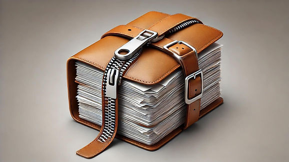

```markdown
# Evertag: Tag Field Mappings

**Writer:** admin  
**Date:** Nov 29, 2024  
**Updated:** Dec 5, 2024  
**Reading Time:** 1 min read  

The list below shows all tag fields supported in Evertag, their internal names, how they appear in the app, and how they map across different tag formats. It’s a handy guide to understanding how Evertag manages tags for various audio formats.


## Categories

- [How To](https://www.everappz.com/blog/categories/how-to)

## Recent Posts

### [How to Optimize Your App Store Keywords and Metadata — and the Best Free Tool to Help You](https://www.everappz.com/post/how-to-optimize-your-app-store-keywords-and-metadata-and-the-best-free-tool-to-help-you)


- **Views:** 101
- **Likes:** 1

### [How to Transfer Your Music Library Between Devices in Evermusic: Step-by-Step Guide](https://www.everappz.com/post/how-to-transfer-your-music-library-between-devices-in-evermusic-step-by-step-guide)


- **Views:** 985
- **Likes:** 2

### [How to Archive (ZIP) Playlists, Albums, Artists, and Genres in Evermusic & Flacbox and Transfer to Another Device](https://www.everappz.com/post/how-to-archive-zip-playlists-albums-artists-and-genres-in-evermusic-flacbox-and-transfer-to)



- **Views:** 191
- **Likes:** 1
```