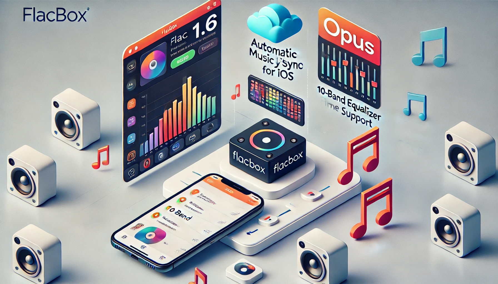

# Flacbox 1.6 for iOS: Automatic Music Library Sync, 10-band Equalizer, OPUS File Format

**Writer:** admin  
**Date:** Jan 25, 2017  
**Updated:** Jul 16, 2024  
**Read Time:** 2 min read

Hello,

Today, we're thrilled to announce a major update for Flacbox: the FLAC music player designed for your iPhone or iPad. We've listened to your feedback and made significant improvements, including the addition of new features and critical issue fixes.

If you're not already familiar with Flacbox, it's a smart and robust FLAC music player and streamer for your iOS devices. With Flacbox, you can enjoy your FLAC music directly from cloud storage or your home computer.

**Here's what's new in this version:**

### 1. Automatic Music Library Sync:
- Tired of manually adding and removing tracks? Flacbox now offers automatic music library synchronization. Our sync manager scans selected folders and adds all discovered audio files to your music library. No more manual updates needed.
- To enable automatic music library sync, go to Settings -> Music Library -> Automatic Sync and choose either Wi-Fi only or Wi-Fi + cellular network.
- Navigate to the 'Sync Folder' section and tap 'Change Settings' to select which folders should be synced with your music library. We recommend choosing folders with audio files to minimize network requests.
- Enable 'Background sync' to allow sync manager to work in the background when the music player is active. Note that this may consume additional battery power.

### 2. 10-band Equalizer:
- Your requests have been answered! Flacbox now includes a 10-band equalizer accessible from the Player screen or within Settings. Adjust equalizer frequency from -12dB to +12dB.
- Choose from built-in presets or create your custom settings. Be cautious when adjusting preamplifier power, as excessively loud sound can harm your ears.

### 3. OPUS File Format:
- Flacbox now supports the OPUS audio format, expanding your playback options. Enjoy your audio files in both FLAC and OPUS formats with equalizer support.

### 4. External Flash Support:
- This update introduces a standout feature: external flash card support (SD, micro SD). Connect your flash cards to your iPhone using a Lightning to SD Card Camera Memory Reader Adapter and play your music directly from the memory card.
- Simply insert the flash card into the adapter and connect it to your device. Upon opening Flacbox, you'll see a "PowerDrive inserted" message.
- In the 'Services' section, you'll find the PowerDrive icon at the bottom, displaying your flash card's name and storage usage. Tap on the PowerDrive icon and navigate to your music folder on the flash card. Play any file, and enjoy your music. All audio files will be played directly from your flash card, freeing up space on your iPhone for photos and applications.

### 5. Fixes:
- We've addressed numerous issues, including the 2-second skip at the end of FLAC files.

If you have any questions or discover any issues, please don't hesitate to reach out. Together, we'll continue building an exceptional and user-friendly music player. We value your support and are open to your suggestions for additional features.

Download Flacbox from the App Store: [Flacbox on iTunes](https://itunes.apple.com/us/app/flacbox-flac-player-music/id1097564256?mt=8)

Thank you for your continued support, and feel free to let us know if there are additional features you'd like to see in Flacbox.

---

**Tags:** [equalizer](https://www.everappz.com/blog/tags/equalizer), [musiclibrary](https://www.everappz.com/blog/tags/musiclibrary), [sync](https://www.everappz.com/blog/tags/sync), [flash](https://www.everappz.com/blog/tags/flash), [external](https://www.everappz.com/blog/tags/external), [opus](https://www.everappz.com/blog/tags/opus), [flac](https://www.everappz.com/blog/tags/flac)

**Category:** [What's New](https://www.everappz.com/blog/categories/what-s-new)