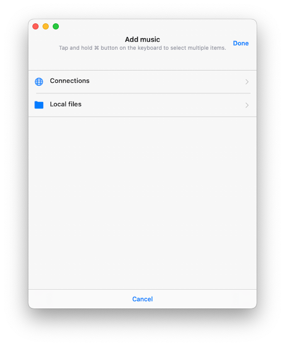
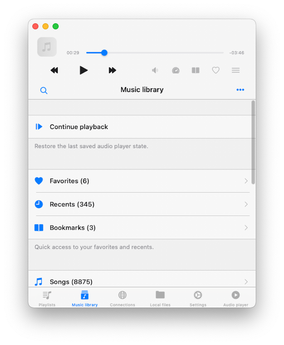
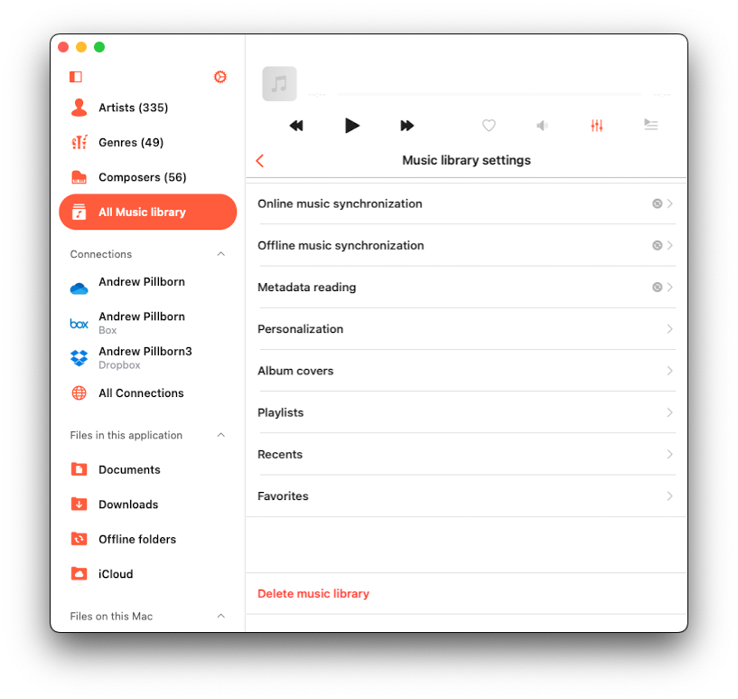
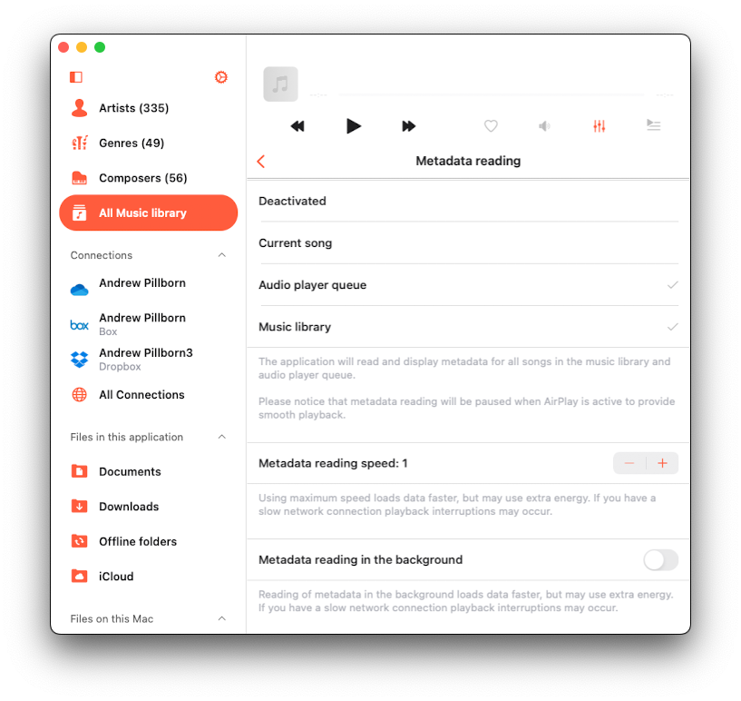
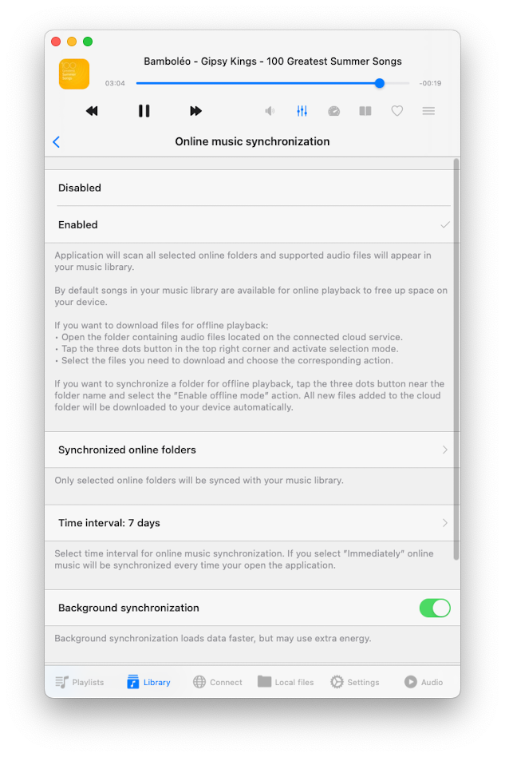
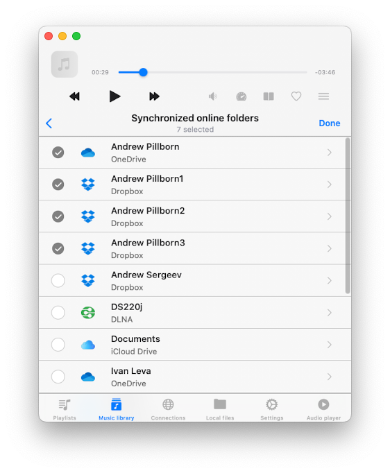
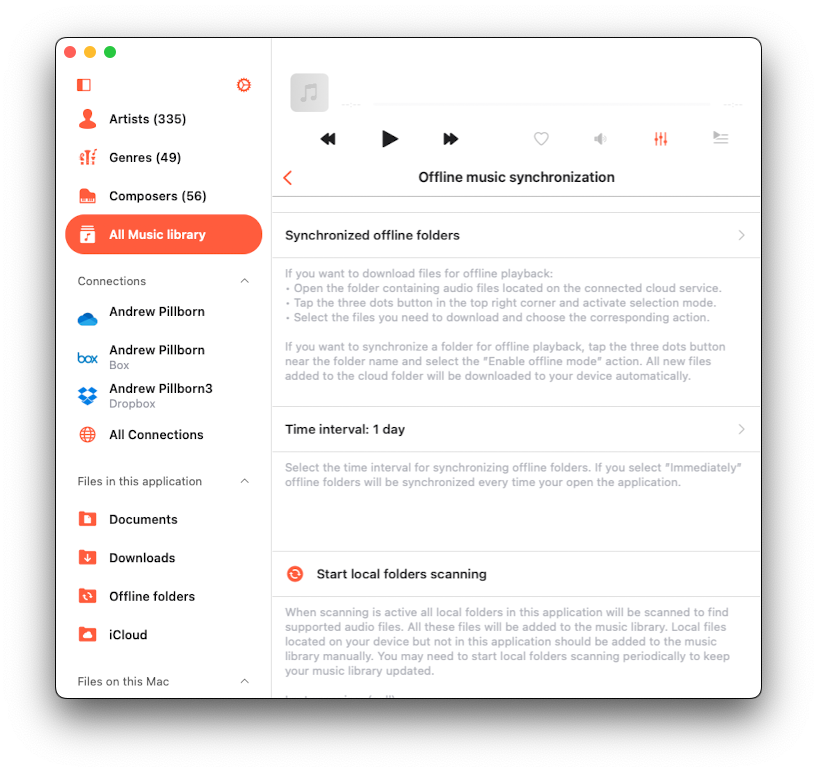
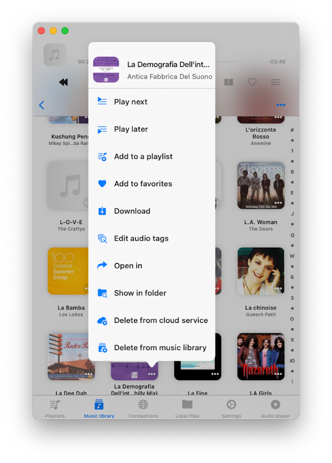
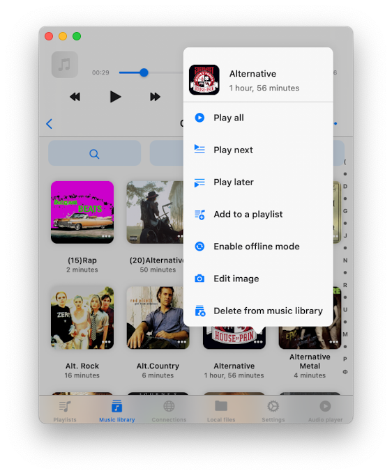
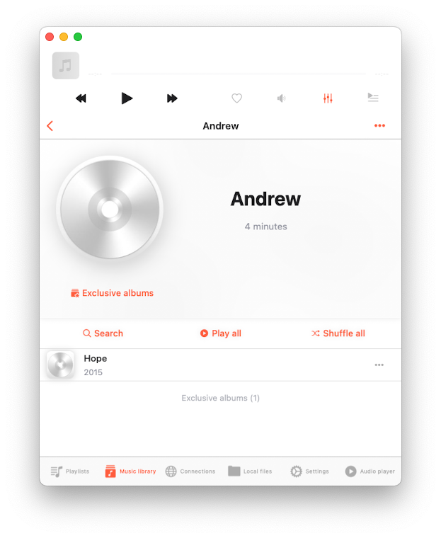

# Flacbox Guide: Music Library

**Writer:** admin  
**Date:** Feb 1, 2020  
**Updated:** Dec 8, 2024  
**Reading Time:** 10 min read

## Easy Music Library Management:
Effortlessly organize your music library. You have two options for building your collection: manual addition or automatic synchronization.

### Manual Addition:
To add tracks manually, tap "Add music," then select folders/files from your connected cloud services or your device. This method creates links to your tracks, preserving the original files' locations to save disk space. For offline access, use the download action or enable offline mode for playlists and track collections.

### Quick Access Section:
At the top of the music library menu, you'll find a quick access section with links to your favorites, recent tracks, and audio bookmarks:

#### Favorites:
Mark songs as favorites from the audio player screen or the options menu.

#### Recents:
Browse recently played tracks.

#### Bookmarks:
Create and manage audio bookmarks while a song is playing. Detailed instructions on working with audio bookmarks can be found [here](#).

### Continue Playback:
This feature restores your audio player queue to its last saved position if enabled in application settings (Settings - Audio player - General - Save audio player state).

### Organized Library Categories:
All the tracks in your library are thoughtfully grouped by source types and music tags:

#### Online music:
Discover online music from your cloud services.

#### Offline music:
Access offline music available for playback from the local files section, which includes files located in the application’s Documents directory as well as files located on your device that have been imported into the music library.

#### Music on this iPhone/iPad/Mac:
Explore local music imported into the application from your iPhone, iPad, or Mac.

#### Songs, Albums, Artists, Genres, Composers:
These categories organize your tracks by music tags.

#### Search:
Use the search feature to quickly find any song, artist, album, or genre in your music library.

### Music library settings:
Tap the three dots button to access the More Actions menu, which includes the "Settings" option for configuring your music library settings.

### Metadata Reading:
When you add tracks to your library, the metadata reader gets to work. This background process reads all metadata from your tracks and organizes them by Artist, Album, Genre, and Composer.

#### Available Modes for Metadata Reader:
- **Deactivated:** The metadata reader will be deactivated, and file names will be shown instead of data from audio tags.
- **Current Song:** The application will read metadata only for the currently playing song. Use this option if you have a slow network connection to prevent the metadata reader from sending many requests to the cloud server, which may cause playback interruptions.
- **Audio Player Queue:** The app will read metadata for all songs in the audio player queue.
- **Music Library:** The app will read metadata for all songs in the music library.

#### Metadata Reading Speed:
You can adjust the speed of metadata reading to load data faster, but be aware that this may use more energy.

#### Metadata Reading in the Background:
When background synchronization is enabled, the metadata reader works in the background. However, if the application consumes significant energy during background audio playback, iOS may suspend the app. So, be cautious when enabling the background metadata reader. If you have a large music collection, it’s advisable to use the desktop version of the application for metadata synchronization. You can then use the data backup and restore feature to transfer the synchronized music library from the desktop, which is available in the app settings.

#### Normalize Metadata Encoding:
When this option is enabled, the app will automatically normalize metadata encoding for all songs in the music library. This resolves issues where audio tags encoding is broken (e.g., after editing files on a Windows PC) and prevents incorrect information from displaying while a track is playing or added to the library.

#### Start Metadata Reading:
Tap this action to start the metadata reader. The operation progress will be displayed below.

#### Importantly:
The metadata reader only updates metadata in your music library and does not alter the files stored in your cloud account or local storage. To edit metadata for audio files, use the built-in tags editor, which you can activate from the options menu.

#### Reload Metadata:
This action will flag all files in your music library as having missing metadata, prompting the metadata reader to refresh the metadata for every file in your library.

### Online Music Synchronization:
Automatic online music sync allows you to add tracks to your library automatically. To activate this feature, head to music library settings and select synchronized folders.

With this option enabled, the application scans all selected folders, identifies supported audio files, and seamlessly integrates them into your library. You can start or stop synchronization by tapping on the corresponding menu action.

Online music synchronization operates exclusively when the app is in the foreground, which means synchronization may take some time. To speed up the process, leave your app open, connect it to a power source, and enable the 'Screen' -> 'Always active' option in application settings. Alternatively, you can perform online music synchronization on the desktop version of the app and transfer the music library to the iOS version using the data backup restore feature. You can also set how often you want to synchronize your online music library. If you set it to "immediately," online sync will start every time you open the application.

### Offline Music Synchronization:
Here you can configure offline music synchronization.

#### Synchronized Offline Folders:
When you make an online folder on your cloud server available offline (using the More Actions menu), this folder will appear here. The folder content will be downloaded to the Local Files -> Offline Folders section. When you change the online folder on the cloud server (adding, removing, or updating files), the app will check for changes and update the local copy of this folder on your device.

#### Time Interval:
You can set the time interval for how often the app should check offline folders for modifications.

#### Start Local Folders Scanning:
This option scans all local folders located in the application’s Documents directory to find supported audio files. All these local files are seamlessly added to your music library. Local files located on your device but outside of this application must be added to the music library manually, as the app does not have access to files outside the application Documents directory due to iOS/MacOS security restrictions.

#### Important:
It is advisable to periodically initiate offline music synchronization to keep your music library updated with your local files.

### Personalization:
In this section, you can configure the music library screen style to suit your preferences. Three options are available: Plain menu, Grouped menu, Tabbed menu.

#### Album Covers:
Here, you can enable the search for album covers on the internet and within your music folders. You can also choose the quality of album covers stored on your device and manage your cached album covers. By default, the app will check for embedded album covers in your tracks and display them if available. If there are no embedded album artworks and the ‘Search in the folder’ option is enabled, the app will check the enclosing folder for JPEG or PNG images and use them as album artwork for all tracks in that folder. If no artworks are found in the folder and the ‘Search on the Internet’ option is enabled, the app will use the track’s metadata to find album artwork online.

#### Playlists:
You can enable the option to add the same song to a playlist twice. By default, this option is disabled.

#### Recents:
You can manage your recently played songs list.

- **Delete List:** You can delete the entire list of recently played songs.
- **Change List Size:** You can set the number of items that should appear in the list.
- **Export Songs List:** Use this action to export your recently played songs list in different formats: M3U, CSV, or TXT. Detailed instructions are available on our website [here](https://www.everappz.com/post/export-tracks-collection-from-evermusic-flacbox-to-m3u-csv-txt).

#### Favorites:
You can manage the list of your favorite songs.

- **Simultaneous Editing:** Enable this option to add a song to the favorites list in both the music library and the files section simultaneously.
- **Delete List:** You can delete the entire list of favorite songs.
- **Export Songs List:** Similar to the Recents section, you can export the list of your favorite tracks in different formats: M3U, CSV, or TXT.

### Delete music library:
Action will erase the music library database, but it will leave your music files untouched.

### Content loading limit:
By default, the application uses pagination to reduce content loading time. However, you can disable this option and allow the application to load all available data at once. To do so, open application settings, scroll down to "Personalization" -> "Content loading limit" and choose "Deactivated".

### Main Menu Style:
You can configure the Media Library menu style. Available options are Plain Menu and Grouped Menu. To change this, open Settings, then go to Personalization, and select Main Menu Style.

### Top Toolbar
Located just beneath the navigation bar, the top toolbar offers several convenient actions: "Search," "Play all," "Shuffle all," and "Continue playback." You can reveal or hide this toolbar with a simple swipe-down gesture.

### Search
The search feature empowers you to locate a specific track, artist, album, or genre within your music library. Within the "Search screen," you have access to the following actions: "Sort," "Filter," "Grid/List."

#### Sort option:
Allows you to arrange results by various criteria such as "Song title," "Duration," "Recently added," "Song number," "Album," "Artist," "Album artist," "Genre," "Composer," "Rating," "Year," and "Beats per minute." The available sort options may vary depending on the search context.

#### Filter:
Enables you to select the track source type:
- "Offline music" - Music available for offline playback.
- "Online music" - Music found in cloud services.
- "Music on this device" - Local music imported into the application from your device but stored outside the application's Documents folder.

#### Grid/List:
Lets you switch between table-style and collection-style content presentation.

### Options Menu
Each song in your music library boasts a menu with more actions, accessed by tapping the three dots button near the song title. These actions vary depending on whether it's a single song or part of a collection.

#### For Individual Songs:
- **Play next:** Adds the song to the top of the player queue.
- **Play later:** Appends the song to the bottom of the player queue.
- **Add to playlist:** Includes the song in a playlist; you can also create a new playlist from the subsequent screen.
- **Add to favorites:** Marks the song as a favorite for quick access.
- **Download:** Saves the song to local files. It appears in the "Local Files" tab and the "Offline music" section.
- **Edit audio tags:** Opens the built-in audio tags editor to fix missing metadata; note that this will alter the song on your storage.
- **Show in folder:** Reveals the folder where the audio file is stored.
- **Show in Finder:** For files imported from your Mac, this action reveals the folder where the audio file is located on your Mac.
- **Open in:** Exports the audio file to another app.
- **Delete from cloud service:** Removes the file from both the music library and cloud storage, and please note that this action is irreversible.
- **Delete from music library:** Deletes the song from your music library, but the file remains in storage. If automatic sync is enabled and the file exists on remote storage, it will reappear in your library after a sync operation.

#### For Song Collections (e.g., Albums, Artists, Genres, Composers):

- **Play all:** Replaces the player queue with songs from the selected collection.
- **Play next:** Adds the songs from this collection to the top of the player queue.
- **Play later:** Appends the songs from this collection to the bottom of the player queue.
- **Add to playlist:** Includes songs from this collection in a playlist, with the option to create a new playlist.
- **Enable offline mode:** Downloads songs from this collection to local files. These downloaded songs will appear in the "Local Files" tab and the "Offline music" section of your Music Library. If new items are added to the collection on the server, they will be downloaded automatically to "Local Files."
- **Edit image:** Allows you to change the album cover for the song collection.
- **Delete from music library:** Removes the song collection from your music library. However, this action does not delete the actual files from storage. If automatic sync is enabled and the files exist on remote storage, they will reappear in your library after a sync operation.

### Selection mode:
You can activate selection mode using the More Actions button in the top right corner. In this mode, you can select multiple tracks and perform various actions.

### Tags Grouping
#### Songs, Albums, Album Artists, Artists, Genres, Composers:
These categories help you organize your tracks by music tags. When you add tracks to the music library, the app reads the tracks’ metadata and groups them by these categories. If you don’t see all your albums, ensure the app has scanned all tracks. You can check the scanning progress in Settings -> Music Library -> Metadata Reading -> Number of Processed Files in Music Library. For local files, you can also rescan offline folders in Settings -> Music Library -> Offline Folders Sync -> Start Local Folders Scanning. After the metadata reader completes all operations, you can see the following categories in your music library:

- **Songs:** All songs are grouped by the TRACK_TITLE tag. You can check the sort order using the More Actions menu in the top right corner.
- **Albums:** Songs are grouped by the ALBUM_NAME tag, while artist, album artist, and composer tags are skipped. If you have several albums with the same name but different artists, consider using the Exclusive Albums sorting described below.
- **Album Artists:** Songs are grouped by the ALBUM_ARTIST_TAG only.
- **Genres:** Songs are grouped by the GENRE tag.
- **Composers:** Songs are grouped by the COMPOSER tag.

When you open the Artist, Album Artist, or Composer sections, you can see a switcher for Songs/All Albums/Exclusive Albums/Solo Albums:

- **Songs:** Displays all songs where this Artist/Album Artist/Composer is set in the audio tags.
- **All Albums:** Shows compilation albums and all albums where the artist is present.
- **Exclusive Albums:** Shows albums where the specified artist is the only artist with that album name.
- **Solo Albums:** Shows albums where only the specified artist’s tracks are displayed, even if other artists have albums with the same name.

## Tags:
- [music](https://www.everappz.com/blog/tags/music)
- [guide](https://www.everappz.com/blog/tags/guide)
- [flacbox](https://www.everappz.com/blog/tags/flacbox)
- [library](https://www.everappz.com/blog/tags/library)

## Category:
- [Guide](https://www.everappz.com/blog/categories/guide)