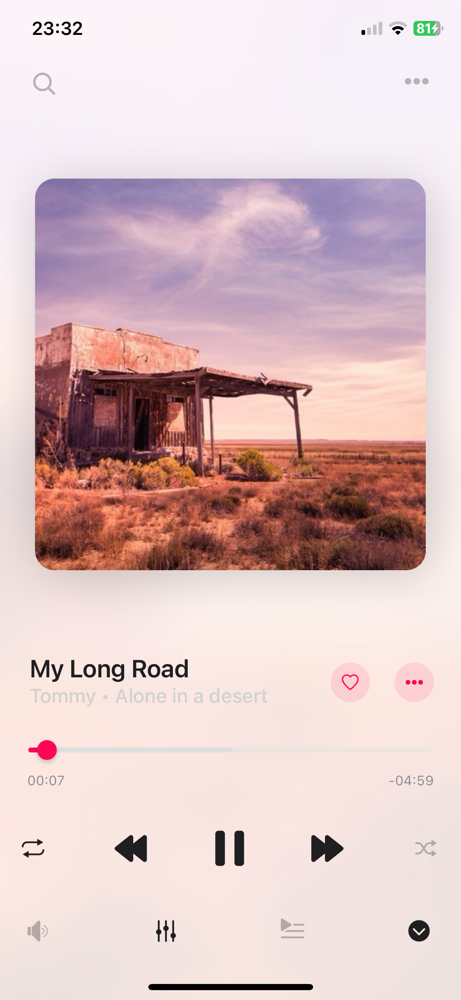
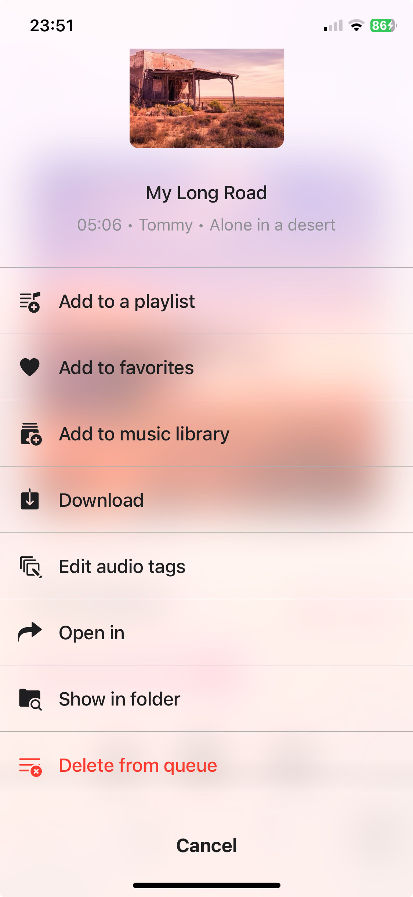
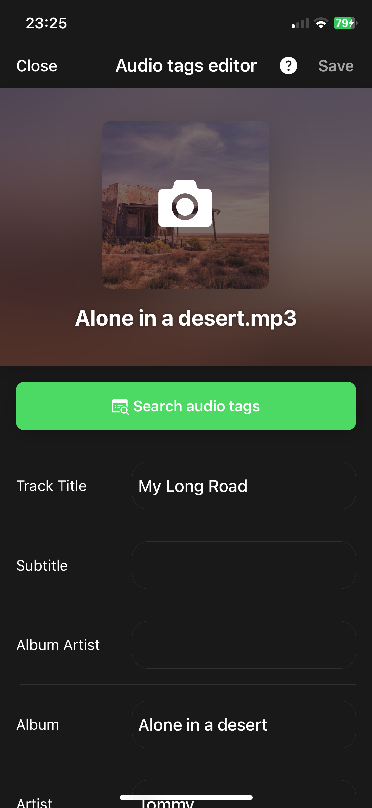
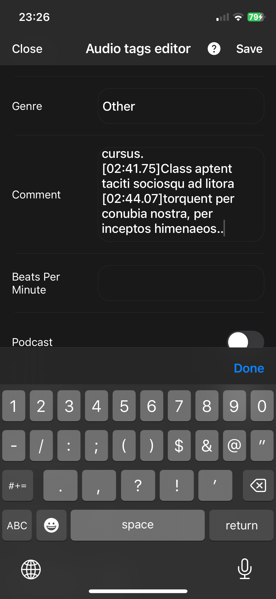
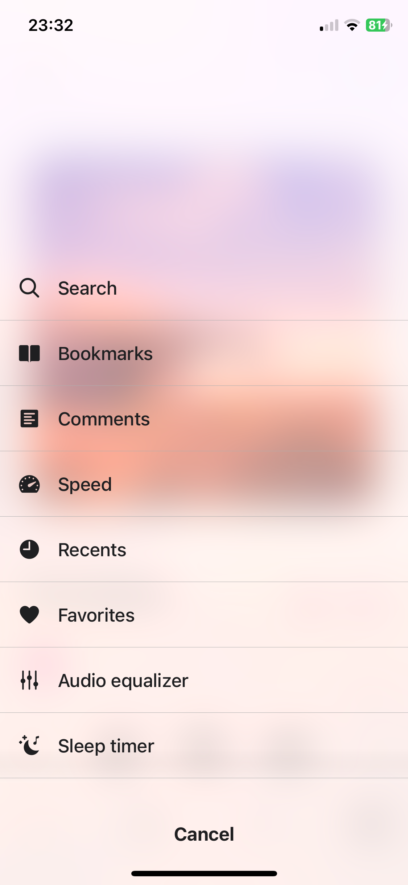
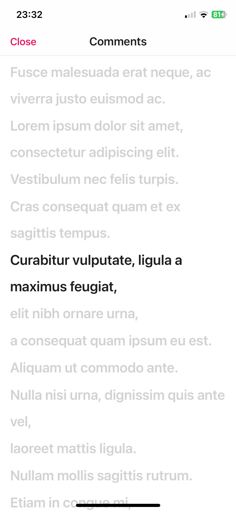
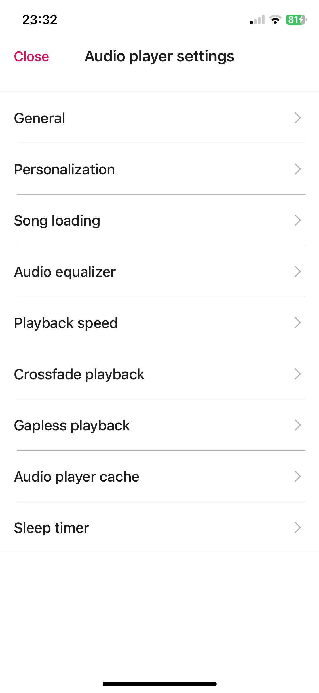
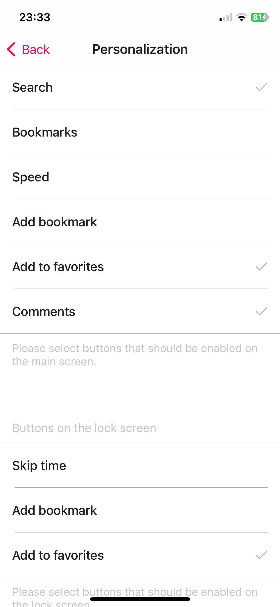
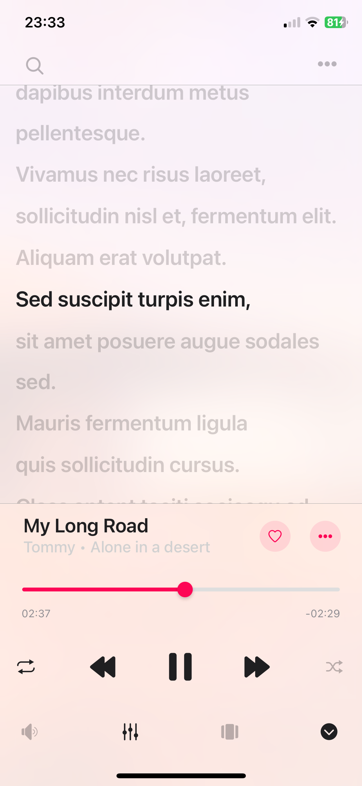

# How to Add and View Comments to Your Audio Tracks on iPhone, iPad, and Mac with Evermusic and Flacbox

**Writer:** admin  
**Date:** Dec 26, 2023  
**Updated:** Dec 6, 2024  
**Reading Time:** 4 min read  

## Introduction:
There are moments when you find the need to add comments to your tracks and read them while a song is playing. Consider scenarios like learning a foreign language through audio lessons, where having textual information is essential. The good news is that in the latest version of Evermusic and Flacbox, you can add your comments to a track, and the app seamlessly displays them while the song is playing. This feature adds a new layer of interactivity, making your music experience even more personalized and versatile.

## How to Add Comments:
To start adding comments, simply utilize the built-in audio tags editor. While a track is playing, navigate to the audio player screen and tap the three dots button next to the track title.



From the available options, select 'Edit audio tags' menu item.



In the audio tags editor, you'll find the option to edit various audio tags such as 'Track Title,' 'Album,' 'Artist,' 'Genre,' and 'Artwork.'



However, what captures our interest at this particular moment is the 'Comment' section. Simply scroll down and tap the text field to initiate the editing process. Whether it's your thoughts on the song or language-learning notes, this feature allows you to input any text.



## Timed Comments:
Take your comments to the next level by inserting time markers. Using the format [MM:SS.SS], you can ensure that your comments are highlighted precisely when the audio player reaches specific time intervals during playback. It's a dynamic way to engage with your music, providing context and insights at key moments.

```
[id: Phasellus]
[ti: Lorem Ipsum]
[ar: Neque Quisquam]
[al: Nullam Cursus]

[00:59.83][01:10.28][03:34.94][03:45.64]Lorem ipsum dolor sit amet, consectetur adipiscing elit.
[01:05.75][03:41.15]Fusce malesuada erat neque, ac viverra justo euismod ac.
[01:16.59][03:51.14]Vestibulum nec felis turpis.
[01:21.55]Cras consequat quam et ex sagittis tempus.
[01:23.13]Curabitur vulputate, ligula a maximus feugiat,
[01:25.36]elit nibh ornare urna, 
[01:27.31]a consequat quam ipsum eu est.
[01:28.92]Aliquam ut commodo ante.
[01:30.46]Nulla nisi urna, dignissim quis ante vel,
[01:32.48]laoreet mattis ligula. 
[01:33.86]Nullam mollis sagittis rutrum.
[01:36.01]Etiam in congue mi, 
[01:38.11]a dictum tortor.
```

## Saving Your Comments:
Once you've crafted your comments and added any timed markers, a simple tap on 'Save' applies the changes seamlessly. Your comments are now integrated into the track's metadata, ready to enhance your listening experience.

## How to View Comments:
Evermusic and Flacbox make it effortless to access and enjoy your comments while listening to music. On the player screen, tap the three dots button in the top right corner (in Modern style) and choose 'Comments' from the menu. A full-screen 'Comments screen' appears, presenting your comments in a visually appealing and organized manner.



## Timed Comments in Action:
If you've added timed comments, witness the app intelligently highlighting them in sync with your music playback. As you scroll through the comments, tapping on any specific comment instantly prompts the audio player to jump to the corresponding time, offering a seamless and interactive experience.



## Activating the 'Comments' Button:
For those who frequently use this feature, Evermusic and Flacbox offer a more convenient way to activate it. On the player screen, tap the three dots button at the top right and select 'Settings.' On the 'Audio player settings' screen choose 'Personalization'.



Scroll down to the 'Buttons on the main screen' section. Put a check box next to 'Comments' to seamlessly integrate this feature into your main screen.



## Switching Between Modes:
Now, on the player screen, tap the 'View mode' button at the bottom of the screen next to the 'Equalizer' icon to switch between 'Audio player queue,' 'Comments,' and 'Artwork' modes. This customization adds an extra layer of personalization to your music exploration.



## Switching between Comments / Embedded Lyrics / LRC file:
Once you open the Comments screen, you can switch between three modes by swiping right: Comments, Embedded Lyrics, and LRC File.

1. **Comments Mode:** This displays the content from the COMMENT field of your audio file.
2. **Lyrics Mode:** This shows the embedded lyrics from your audio file. If your audio file has lyrics in the tags, they will appear here. This mode also supports timed text in LRC format. To edit the lyrics tag, use an external audio tag editor like Evertag. You can find LRC format lyrics for free on websites like [Lyricsify](https://www.lyricsify.com). Copy the needed lyrics to your tags and save them to display later on this screen.
3. **LRC File Mode:** Instead of editing audio files, you can place an LRC file in the same folder as the original audio file. Both files should have the same name but different extensions. When you swipe to the third page on the Comments screen, the app will search for the LRC file in the same directory and display its content.

This setup ensures you can easily view comments, lyrics, and LRC files for your audio tracks.

## Conclusion:
The addition of comments to audio tracks in Evermusic and Flacbox marks a significant leap in user engagement and personalization. Whether you're a music aficionado or a language learner, this feature empowers you to interact with your tracks in a whole new way. Dive into the world of personalized audio commentary and rediscover your music library with Evermusic and Flacbox. Enhance your music experience, one comment at a time.

---

**Tags:** [evermusic](https://www.everappz.com/blog/tags/evermusic), [audio](https://www.everappz.com/blog/tags/audio), [editor](https://www.everappz.com/blog/tags/editor), [tags](https://www.everappz.com/blog/tags/tags), [comments](https://www.everappz.com/blog/tags/comments)  
**Category:** [How To](https://www.everappz.com/blog/categories/how-to)