# How To Enable DLNA Media Server on Windows 10 and Play Your Music on iPhone

**Writer:** admin  
**Date:** Nov 26, 2019  
**Updated:** Sep 15, 2023  
**Reading Time:** 2 min read

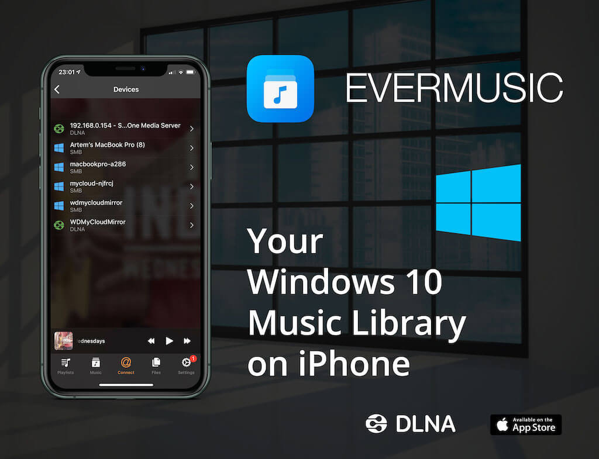

DLNA (Digital Living Network Alliance) is a powerful tool that enables you to effortlessly stream various media content, including music, between DLNA-supported devices on your network. The good news is that Windows 10, and previous versions, come with a built-in DLNA feature, eliminating the need for third-party media servers. Here's how to enable DLNA Media Server on Windows 10 and enjoy music streaming on your iPhone.

## Enabling DLNA Media Server on Windows 10:

1. Click the 'Start' button.
2. Select the 'Settings' icon.

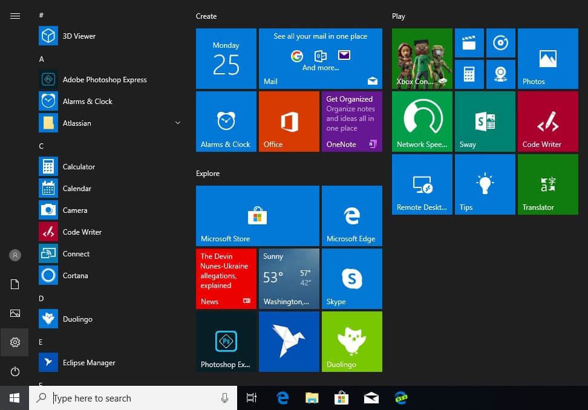

3. On the 'Windows Settings' screen, choose 'Network & Internet.'

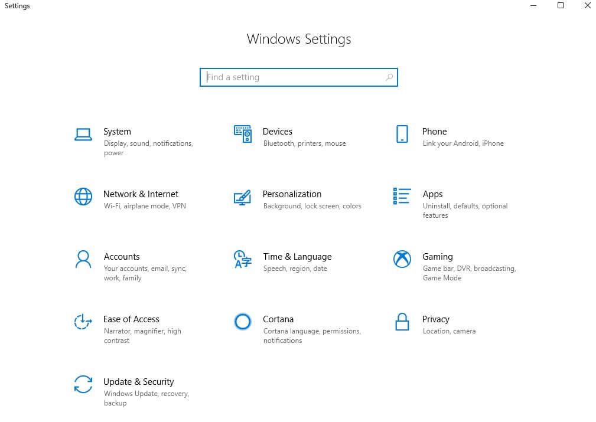

4. Under 'Network,' select 'Network and Sharing Center.'

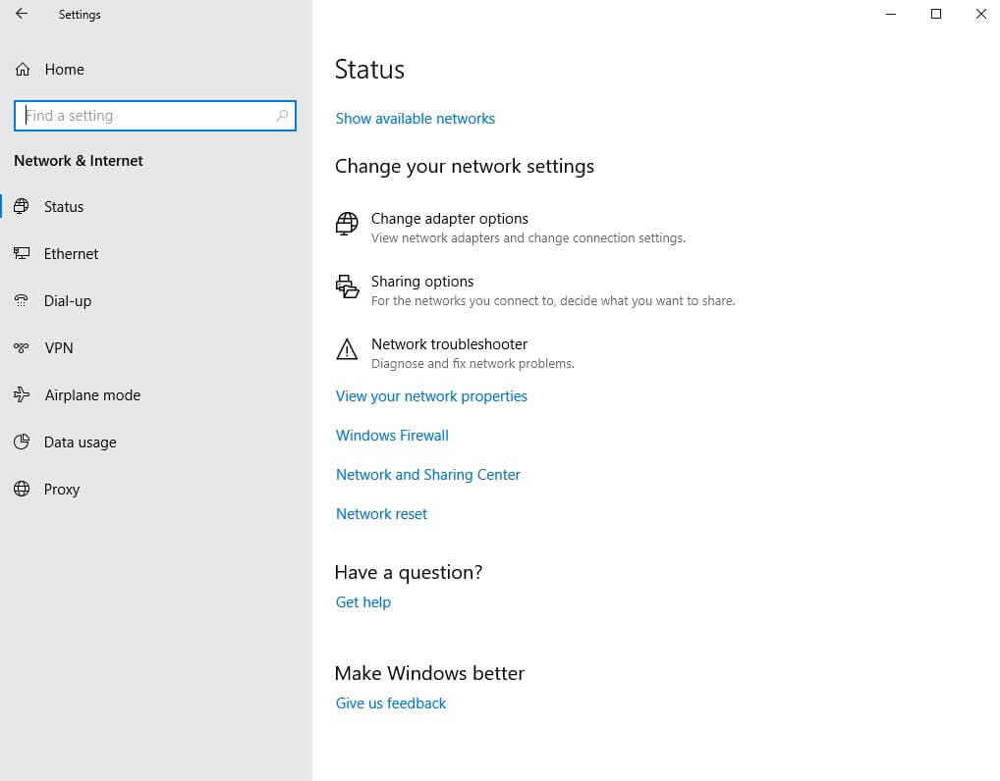

5. On the 'Network and Sharing Center' screen, click 'Change advanced sharing settings' located in the left menu.

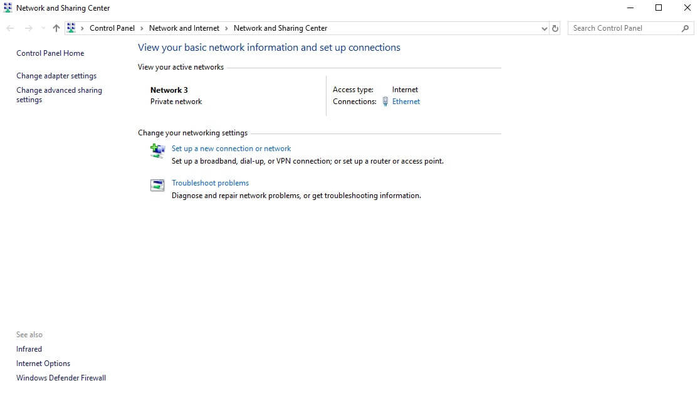

6. In the 'Advanced sharing settings' screen, scroll down to the 'All Networks' section and expand it by clicking the arrow.

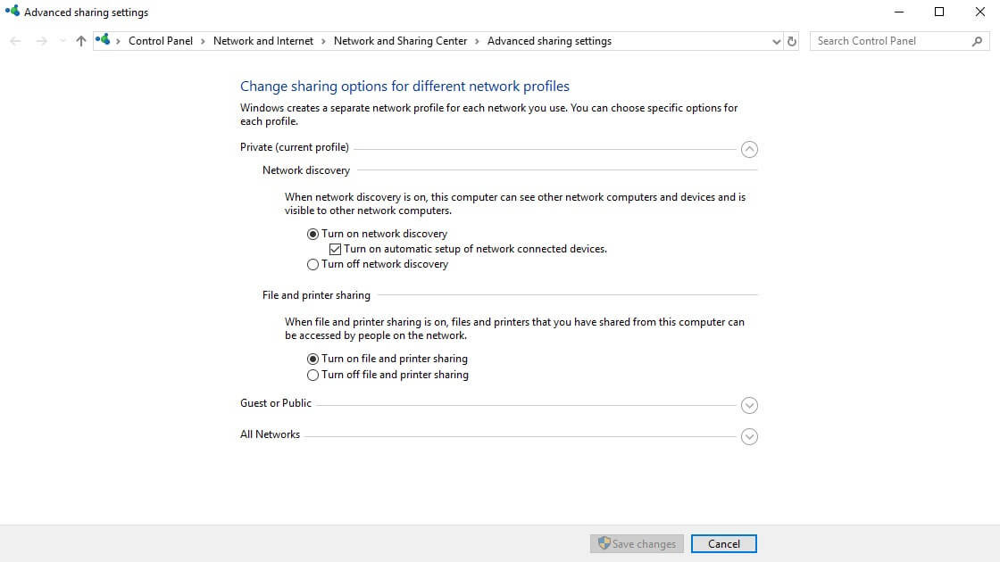

7. Click 'Turn on media streaming' to activate the DLNA server.

8. Give your media library a name and select the devices allowed to access it.

9. Click 'OK' to confirm the operation. Now, your personal folders like Music, Pictures, and Videos will be visible to any streaming devices with UPnP support.

## Disabling DLNA Media Server on Windows 10:

1. Click 'Start' and type 'services' in the search field.

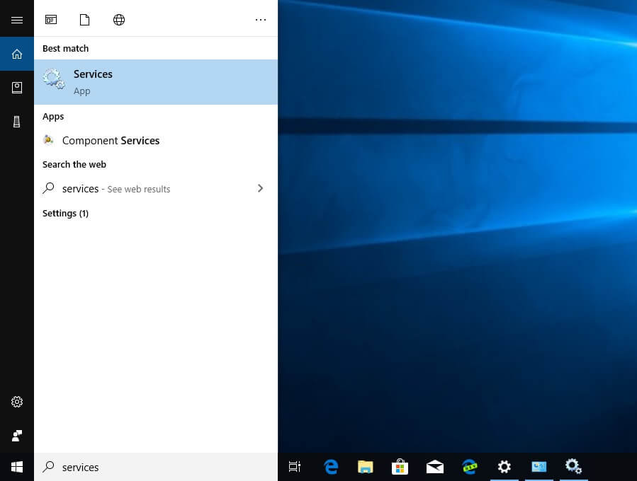

2. In the 'Services' screen, scroll down to locate 'Windows Media Player Network Sharing Service.'
3. Double-click on it and set the 'Startup type' to 'Manual.'
4. Stop the service by clicking on the 'Stop' menu item.

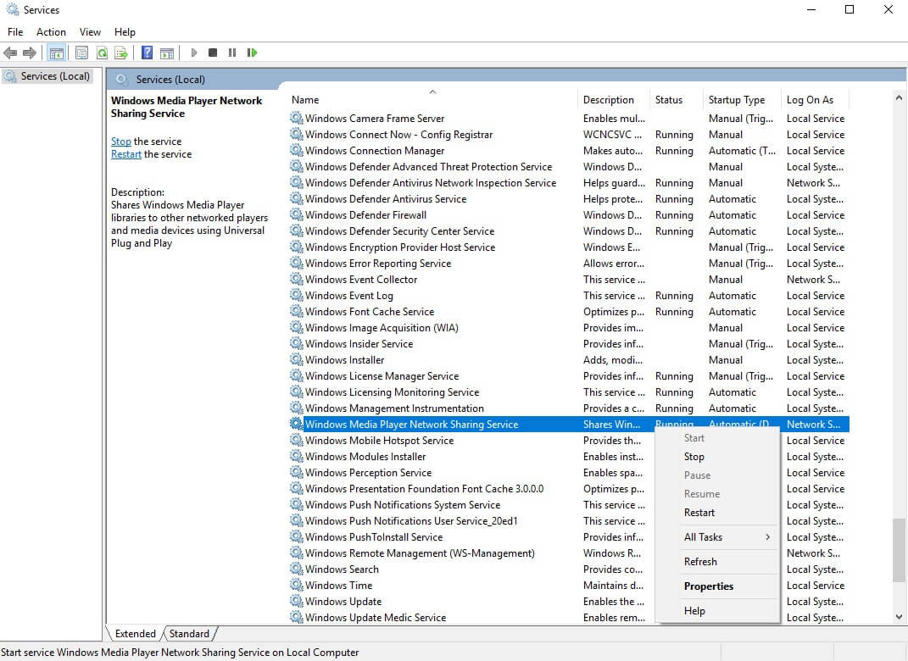

## Playing Your Music on iPhone from DLNA Media Server on Windows 10:

1. Install the free 'Evermusic' app from the App Store: [Evermusic App](https://apps.apple.com/us/app/evermusic-offline-music-player-cloud-streamer/id885367198?ls=1)
2. Open the 'Connections' tab and tap on the 'Available devices' item in the 'Local Network' section.

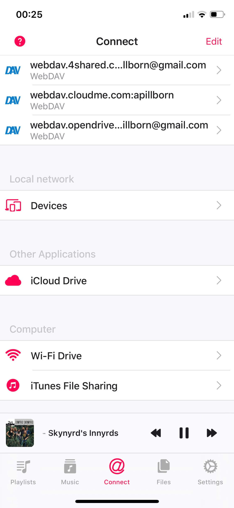

3. Wait a few seconds while the devices list loads and tap on the Windows Media Player DLNA server (e.g., 'MSEDGEWIN10: My Windows Library' in our case).

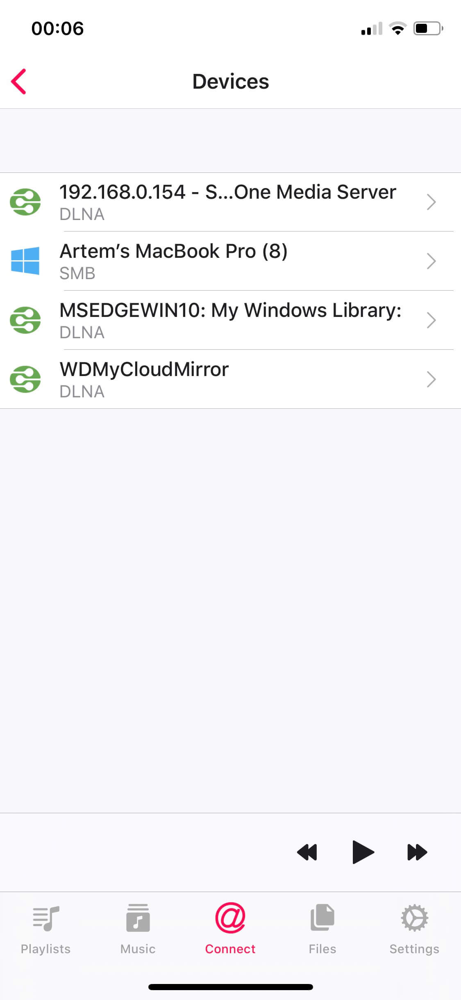

4. You'll see a list of folders available on the media server.

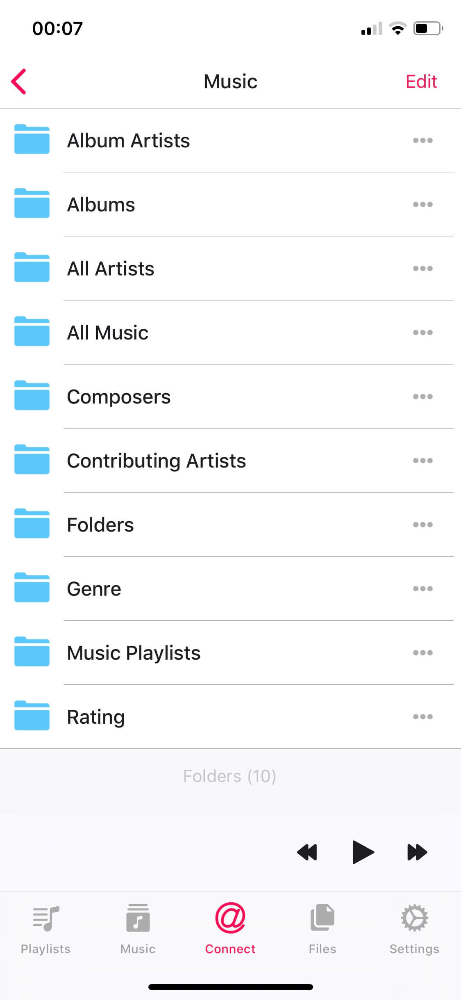

5. Open any folder containing audio files.

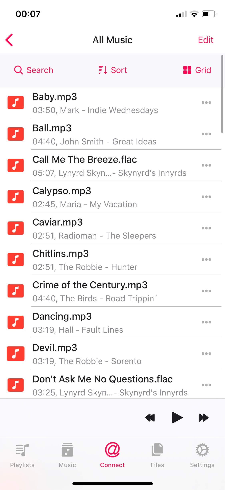

6. Tap on any file to start the audio player.

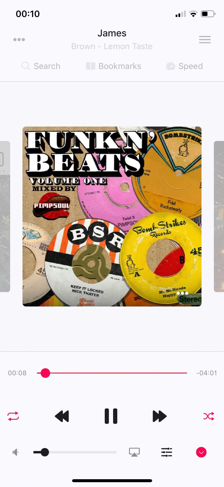

7. To enhance your audio experience, tap the 'Equalizer' icon near the volume indicator at the bottom of the screen to enable the iPod-style equalizer with a preamplifier.

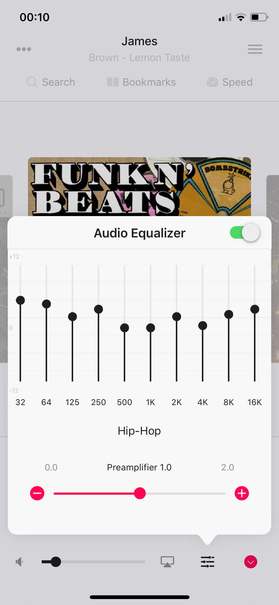

With DLNA Media Server on Windows 10 and Evermusic on your iPhone, you can enjoy seamless music streaming from your computer to your mobile device. Say goodbye to storage limitations and hello to music on demand!

---

**Tags:** [evermusic](https://www.everappz.com/blog/tags/evermusic), [music](https://www.everappz.com/blog/tags/music), [cloud](https://www.everappz.com/blog/tags/cloud), [iphone](https://www.everappz.com/blog/tags/iphone-1), [storage](https://www.everappz.com/blog/tags/storage), [local](https://www.everappz.com/blog/tags/local), [nas](https://www.everappz.com/blog/tags/nas), [windows](https://www.everappz.com/blog/tags/windows), [wifi](https://www.everappz.com/blog/tags/wifi), [listen](https://www.everappz.com/blog/tags/listen), [network](https://www.everappz.com/blog/tags/network), [remote](https://www.everappz.com/blog/tags/remote), [home](https://www.everappz.com/blog/tags/home), [online](https://www.everappz.com/blog/tags/online), [dlna](https://www.everappz.com/blog/tags/dlna)