# How to play local music stored on your iPhone or Mac

**Writer:** admin  
**Date:** Sep 5, 2023  
**Updated:** Dec 6, 2024  
**Reading Time:** 3 min read

In the digital age, streaming services have changed how we listen to music, but there's something special about the music we've collected over the years on our Macs, PCs, or external drives. These cherished local tunes hold personal meaning and nostalgia. Thankfully, playing this music on your iPhone and Mac is still possible and enjoyable. Whether you want to relive memories or enjoy your unique collection offline, this guide will show you how. We'll explore methods and tools to seamlessly play your local music on your Apple devices, turning them into personal concert halls for your favorite melodies. If you're ready to unlock the potential of your iPhone and Mac for your local music, let's start this musical journey together!

## Step 1: Getting Started with Evermusic (for Standard Audio Formats) or Flacbox (for Lossless Music)

To begin your journey into the world of local music on your iPhone and Mac, start by installing either Evermusic (for standard audio formats like mp3 and wav) or Flacbox (for lossless music in dsd and flac). Both of these apps are available for iOS and MacOS, and you can download them for free.

### For iOS:

- **Evermusic:** [Download Here](#)
- **Flacbox:** [Download Here](#)

### For Mac:

- **Evermusic:** [Download Here](#)
- **Flacbox:** [Download Here](#)

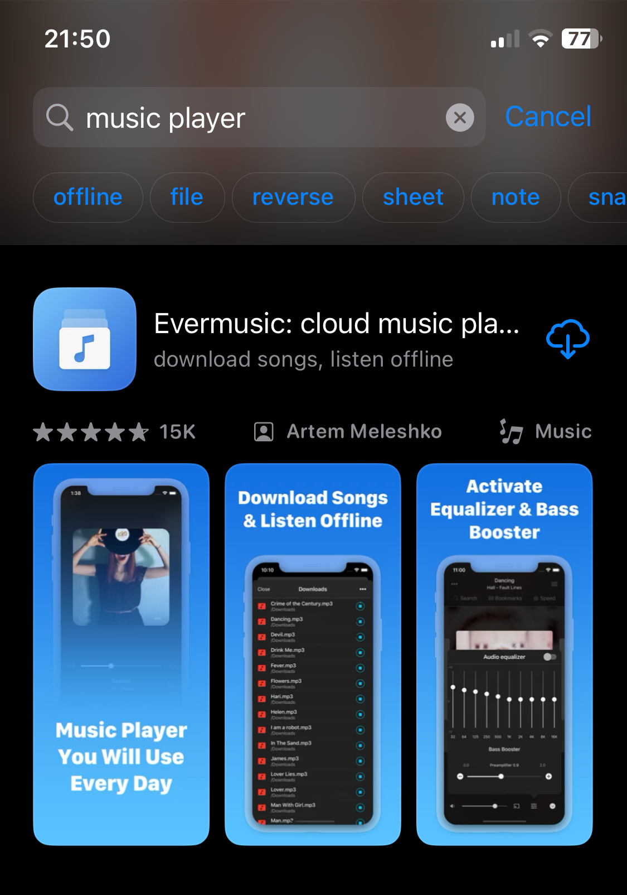

## Step 2: Playing Local Files Located on Your Device

Once you've installed the application, open the "Local Files" screen and scroll down to the "Files on this iPhone" section. From there, choose "Open files..." if you need to select several audio files or "Open folder..." if you want to pick a music folder. The app will scan the folder's content, and all found audio files will be selected.

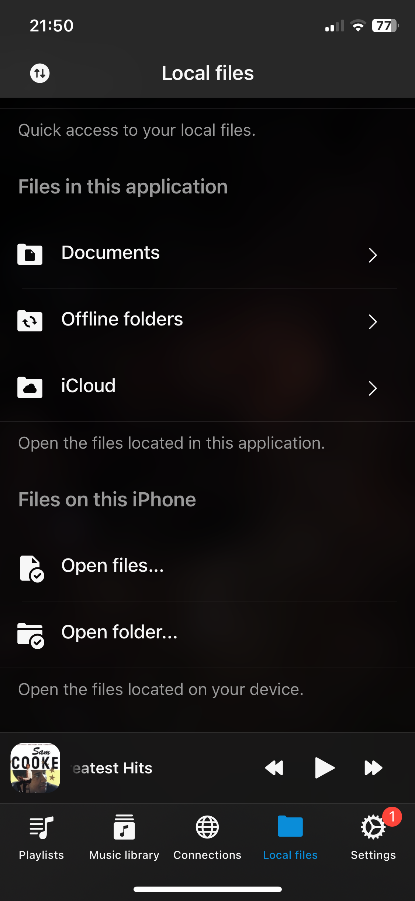

On the next screen, tap the "Browse" item on the bottom tab bar and scroll to the "Locations" section. Select the "On My iPhone" menu item.

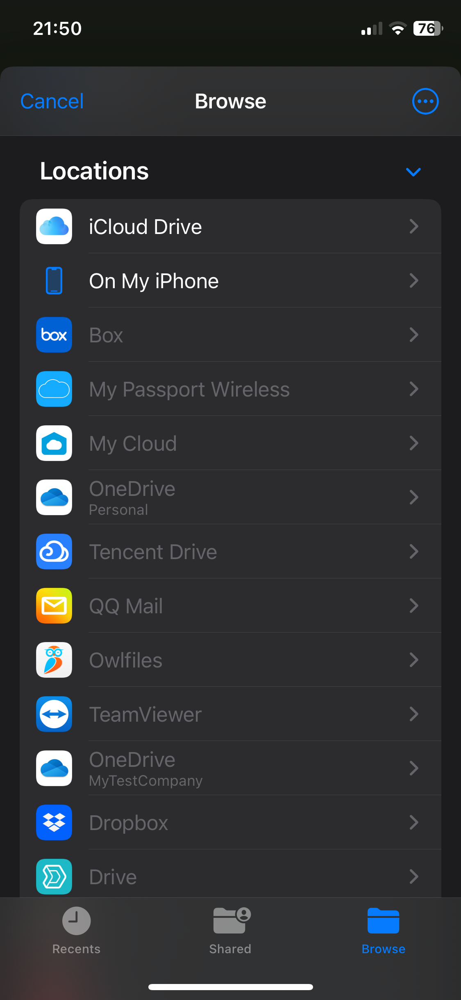

Navigate to your music folder and tap "Open" to confirm the current folder selection.

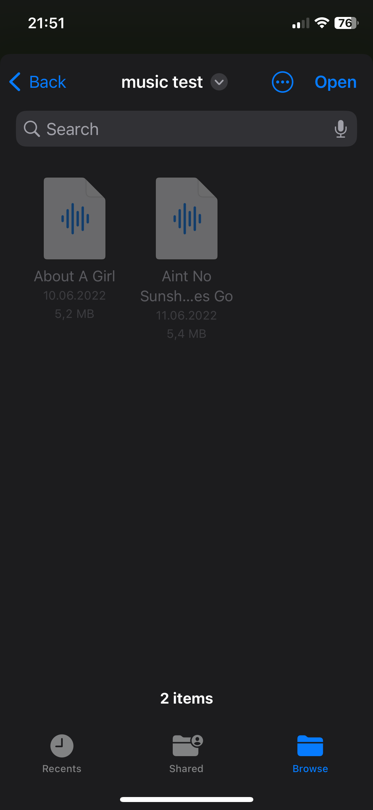

Alternatively, if you chose "Open files..." initially, select the files you want to open and tap "Open" to confirm your selection.

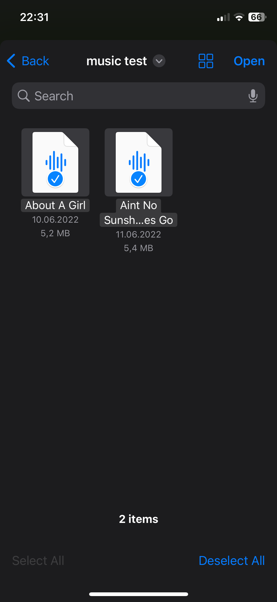

After tapping "Open," a full-screen audio player will appear, and the files will be added to the player queue. These files will be played directly from the selected location without being copied to the application bundle. If you prefer to copy files to the application every time you open them, navigate to "Settings" - "File manager" - "Copy files during opening" and select "Always copy files during opening."

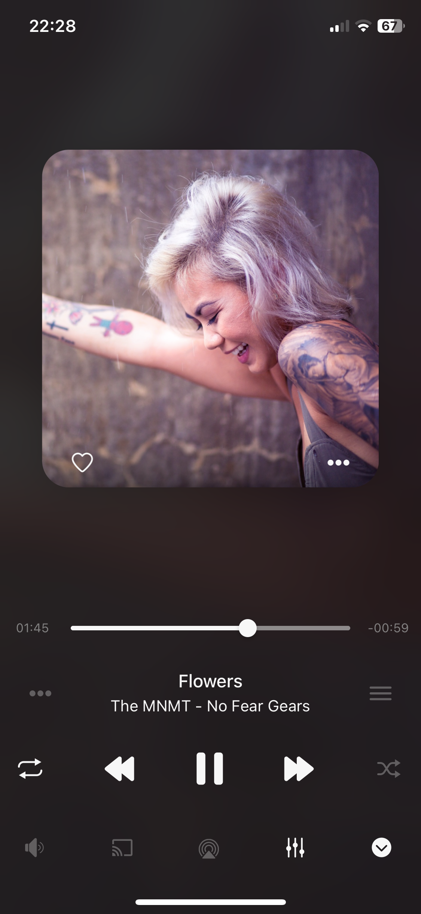

## Step 3: Adding a Folder Located on Your Device to Favorites for Quick Access

You can simplify the process by adding a folder located on your device to your favorites. This way, you won't need to repeat the steps above every time you want to play music. To do this, open the "Local Files" screen and scroll to the "Quick access" section. Tap "Favorites" to access the "Favorite files" screen.

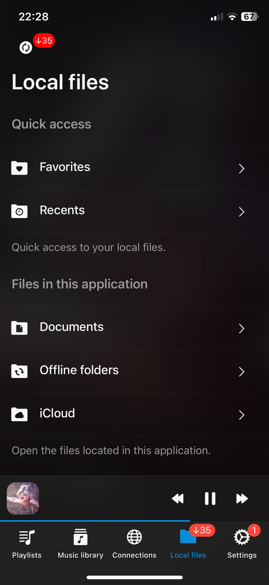

Tap the more actions button (represented by three dots) in the top right corner and select the "Add folder" menu item.

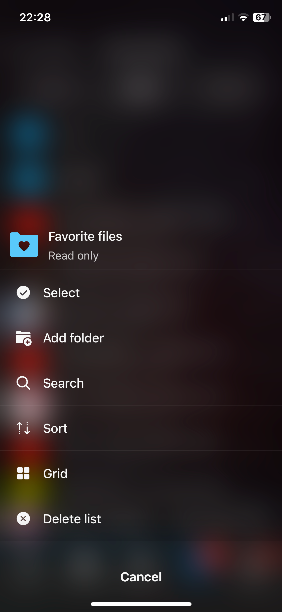

Tap "Files on this iPhone" to open the system file picker.

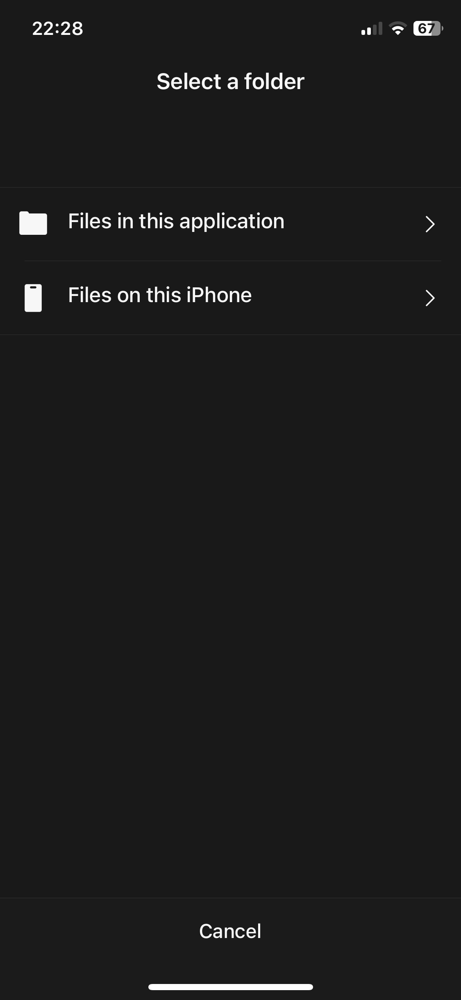

Navigate inside the folder containing your audio files and tap "Open" to confirm your selection.

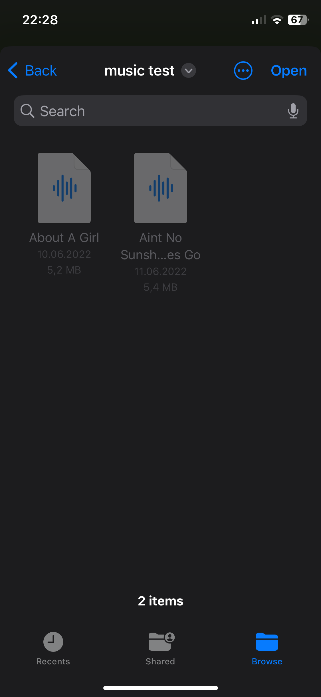

Your folder will be added to "Favorite files," providing you with quick access to your music.

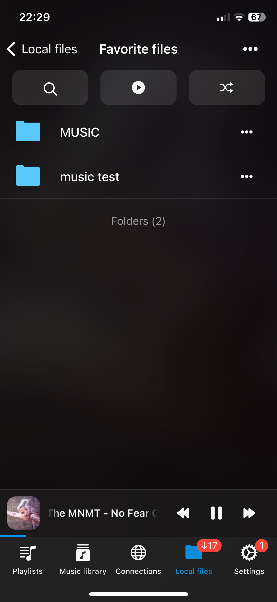

## Step 4: Importing Local Files Located on Your iPhone to the Music Library

If you want to do more than just play audio files located on your iPhone or iPad and prefer to organize them within your Music library, follow these steps:

1. Open the "Music library" screen.

   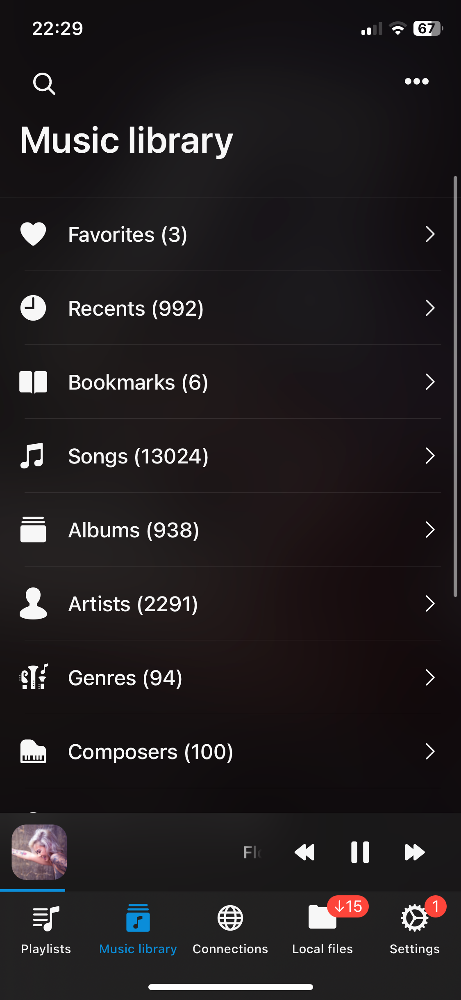

2. Tap the three dots button at the top right corner and select "+ Add music."

   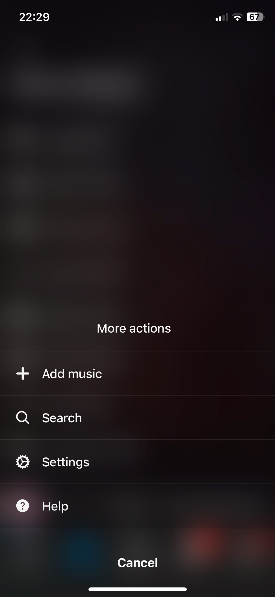

3. On the next screen, select the "Local files" menu item.

   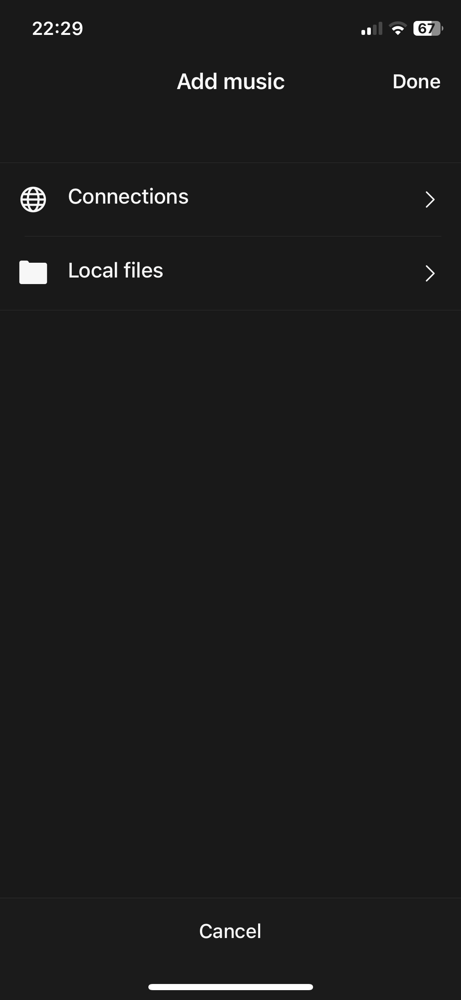

4. Scroll down to the "Files on this iPhone" section and tap "Open files..."

   

5. Select the files located on your device and tap "Open" to confirm your selection.

   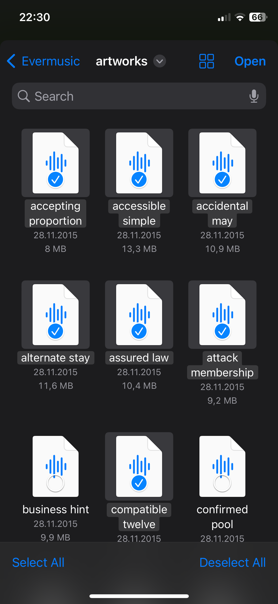

## Step 5: Adding Local Files Located on Your iPhone to a Playlist

To add local files located on your device to a playlist, follow these steps:

1. Open the "Playlists" screen.
2. Tap the more button in the top right corner.
3. Select "+ New playlist" from the menu.

   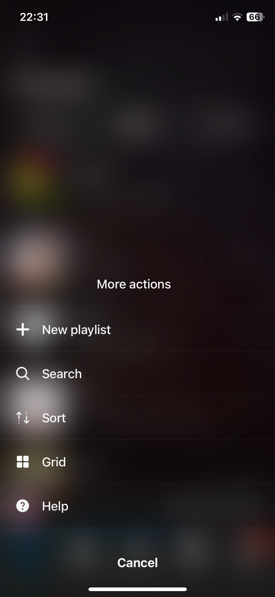

4. Enter a name for your new playlist.

   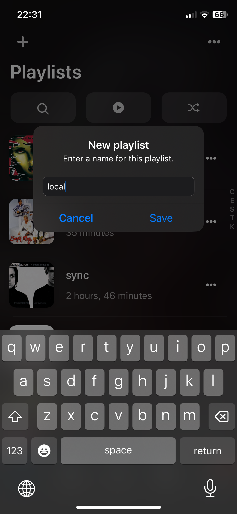

5. On the next screen, select the "Local files" option.

   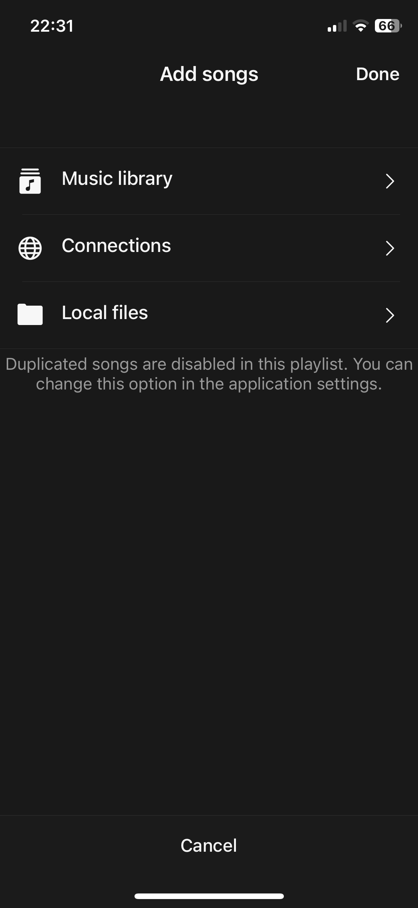

6. Scroll down to the "Files on this iPhone" section and tap "Open files..."

   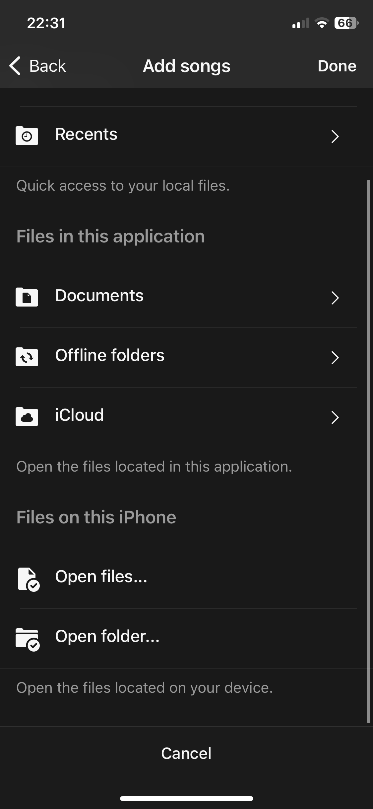

7. Select the audio files you want to add and tap "Open" to confirm your selection.

   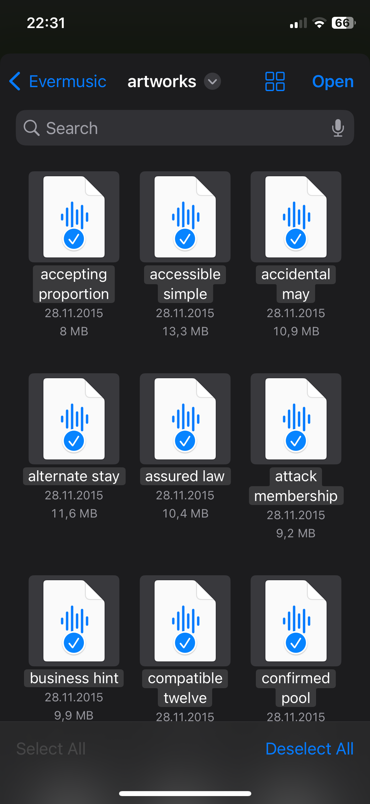

8. The files will be added to a playlist, and you can change the song order and perform other actions using the more button in the top right corner.

   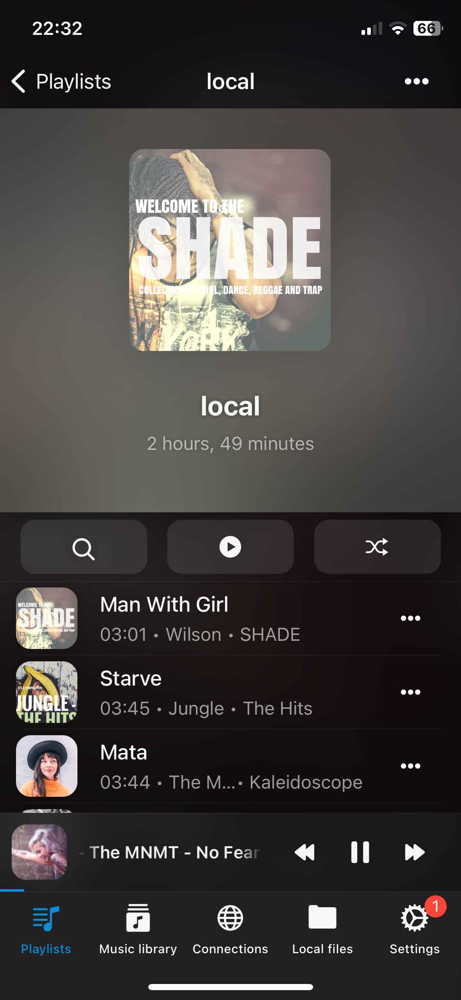

With these simple steps, you can unlock the full potential of your iPhone and Mac as the ultimate platforms for enjoying your cherished local music collection. Say goodbye to the limitations of streaming services and rediscover the magic of your personally curated playlists and songs. Your musical journey is just a few taps away!

---

**Tags:** [music](https://www.everappz.com/blog/tags/music), [files](https://www.everappz.com/blog/tags/files), [local](https://www.everappz.com/blog/tags/local), [play](https://www.everappz.com/blog/tags/play)  
**Category:** [How To](https://www.everappz.com/blog/categories/how-to)