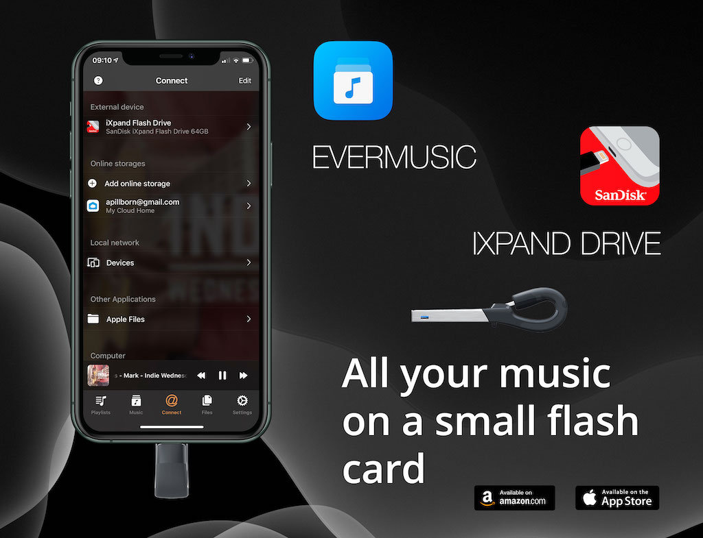
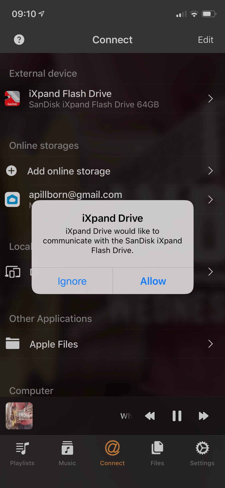
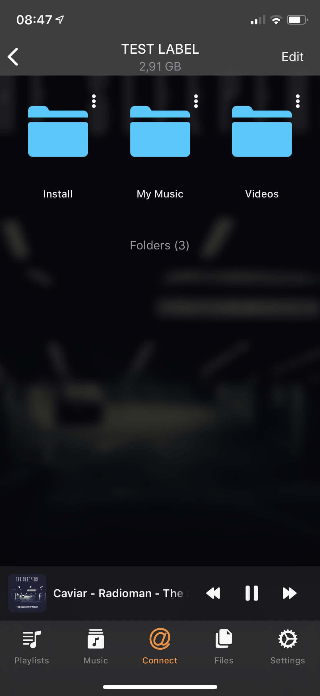
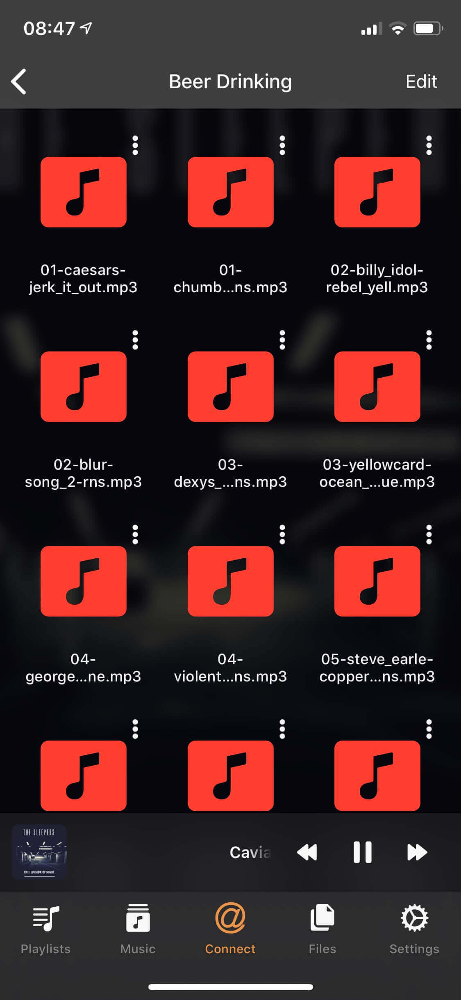
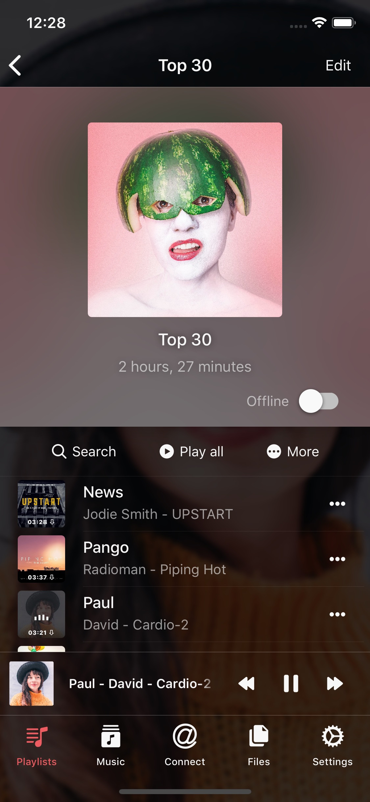
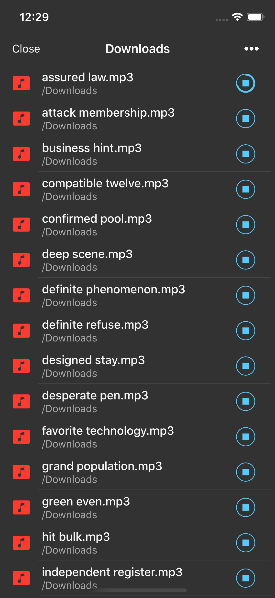

# How To Play Music from USB Flash Drive on iPhone with Evermusic and iXpand by SanDisk

Are you tired of running out of space on your iPhone or iPad? With Evermusic, you can effortlessly listen to your music directly from a SanDisk iXpand Flash Drive and free up precious storage space for photos and other essential apps. Imagine saving up to 256 GB of space on your iPhone! The iXpand Flash Drive is a compact device with a lightning connector on one end and a standard USB connector on the other. You can easily transfer files between your home computer and iPhone.

Currently, the app supports SanDisk Flash Drives with protocols iXpand V1, iXpand V2, iXpand V3, iXpand V6, iXpand V7. You can check if your iXpand Flash Drive is supported using the following steps:

- **Connect** the drive to the iOS device
- Open **Settings**
- Tap **General**
- Tap **About**
- Look for **iXpand Flash Drive**
- Tap **Find App for Accessory**
- The Evermusic app should be listed there

If your device is not supported, the only solution we can advise now is to use an old iXpand Drive device, for example, [iXpand Mini Flash Drive](https://www.westerndigital.com/en-ap/products/usb-flash-drives/sandisk-ixpand-mini-usb-3-0?sku=SDIX40N-016G-GN6NN) or use [Apple adapter](https://www.apple.com/shop/product/MK0W2AM/A/lightning-to-usb-3-camera-adapter) and connect iXpand flash drive using that adapter like a normal USB drive.

If you have a supported device:

**Connect iXpand Flash Drive:** Plug the iXpand Flash Drive into your iPhone or iPad's lightning port. Then, open the Evermusic app.

**Navigate to 'Connections' Tab:** In Evermusic, head to the 'Connections' tab. You'll notice the attached flash drive at the top of the screen in the 'Connected accessories' section.

**Access Your Music:** Open the iXpand Flash Drive by tapping on the SanDisk icon. Here, you'll see all available folders and the total size of content displayed at the top of the screen. If other apps are currently using your drive and causing it to be in a busy state, you may receive a warning message. In such cases, simply close the other apps using your flash drive or unplug it and plug it back in.

**File Management:** Evermusic serves as a file manager, allowing you to perform basic operations like MOVE, DELETE, RENAME, and CREATE NEW FOLDER with your files.

**Playback Your Music:** Once you've opened a folder with music, all available audio files will be visible. Simply tap on any file to start playback. You can even enable the equalizer on the player screen or stream audio content to AirPlay devices such as Sonos, Apple TV, or Google Chromecast.

But Evermusic is more than just a file manager and audio player for your iXpand Flash Drive. The app also creates a Music Library where all your tracks are thoughtfully organized by Artist, Album, and Genre. You can create playlists and change the order of tracks in the audio player queue.

Of course, if you ever want to copy audio files from your flash drive to your iPhone's memory, Evermusic makes it a breeze.

With Evermusic and the SanDisk iXpand Flash Drive, you'll have the freedom to enjoy your music collection without worrying about storage limitations. To learn more about Evermusic, visit [link](https://www.everappz.com/support-evermusic). To discover more about the iXpand by SanDisk, check out [link](http://www.ixpand.com). Say goodbye to storage woes and hello to your music on the go!