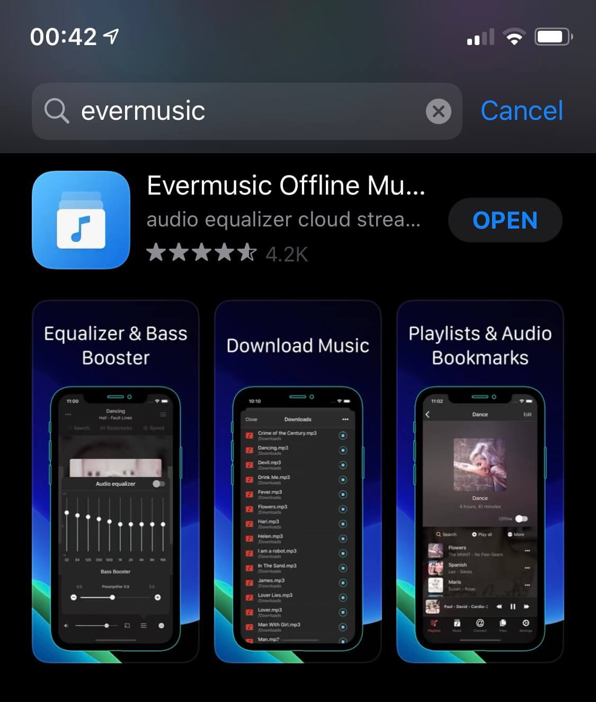
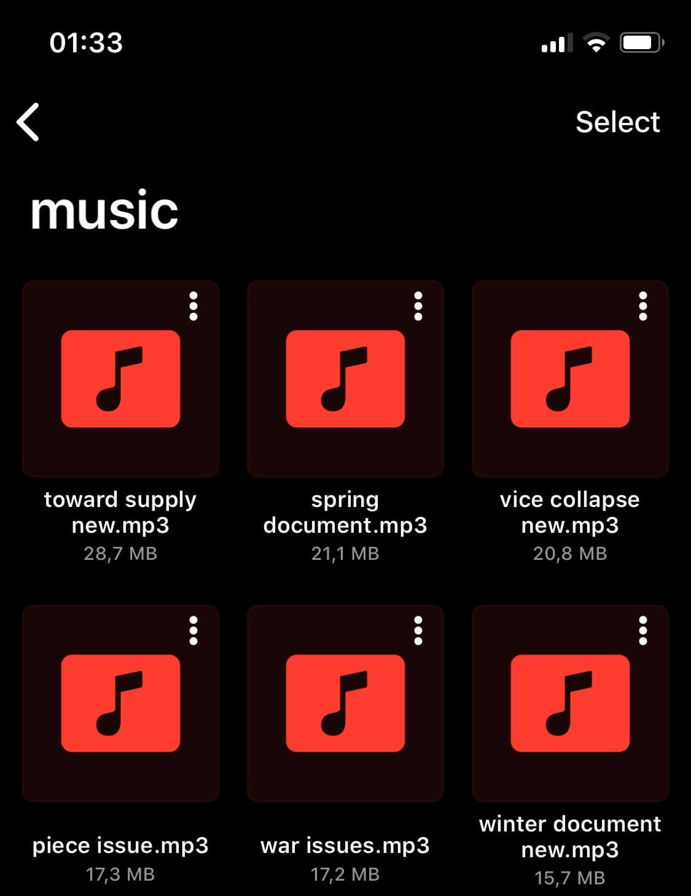
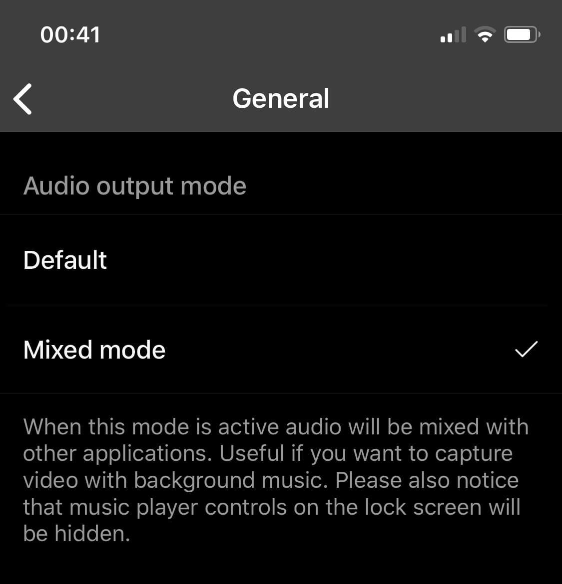
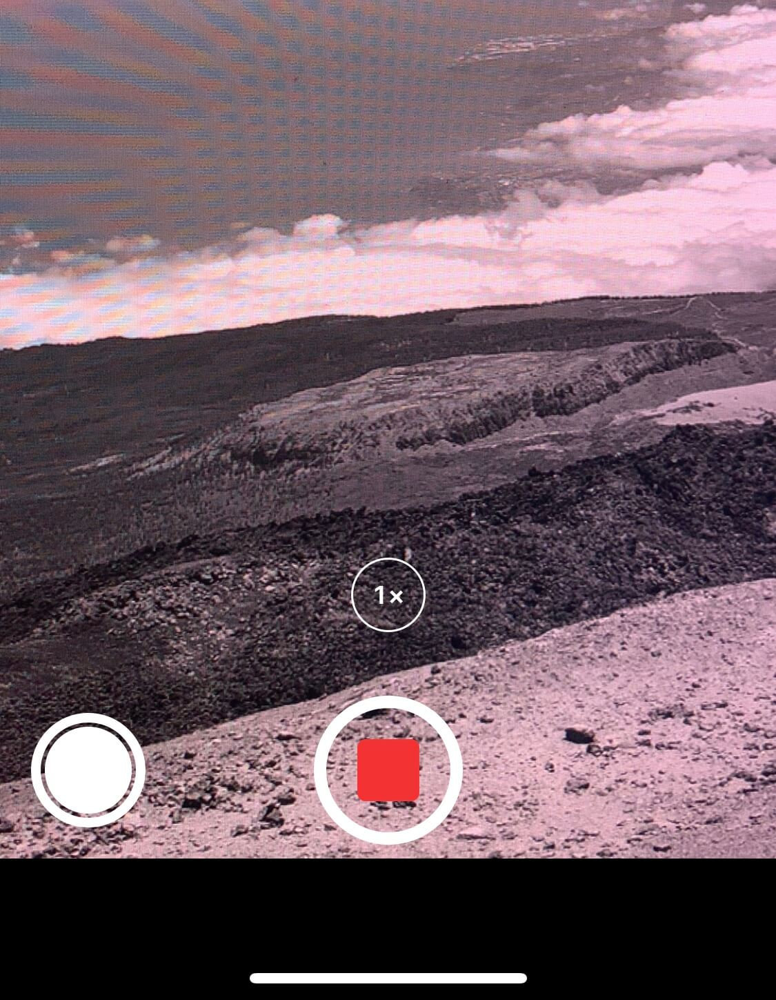

```markdown
# How to Record Video While Playing Music on iPhone

**Writer:** admin  
**Date:** Dec 31, 2019  
**Updated:** Dec 8, 2024  
**Reading Time:** 1 min read


We've just let you know a little trick that allows you to play music in the background while recording video on your iPhone. You may find this useful next time you decide to create a new cool video for TikTok.

1. Open App Store and search for the app called [Evermusic](http://bit.ly/everappz_evermusic). Download it for free.



2. Add some music using [WiFi Drive](https://www.everappz.com/post/how-to-transfer-music-from-computer-to-iphone-without-itunes), [iTunes file sharing](https://www.everappz.com/post/how-to-play-local-itunes-files-on-my-iphone) or import existing music on your iPhone.



3. Open app "Settings" - "Audio Player" - "General" - "Audio Output mode" and change it to "Mixed mode".



4. Start audio player.


5. Open camera app or any other application and start recording.



This trick works on every iPhone.

## Tags

- [music](https://www.everappz.com/blog/tags/music)
- [audio](https://www.everappz.com/blog/tags/audio)
- [iphone](https://www.everappz.com/blog/tags/iphone-1)
- [playback](https://www.everappz.com/blog/tags/playback)
- [mode](https://www.everappz.com/blog/tags/mode)
- [mixed](https://www.everappz.com/blog/tags/mixed)
- [background](https://www.everappz.com/blog/tags/background)
- [output](https://www.everappz.com/blog/tags/output)
- [record](https://www.everappz.com/blog/tags/record)
- [video](https://www.everappz.com/blog/tags/video)

## Categories

- [How To](https://www.everappz.com/blog/categories/how-to)
```