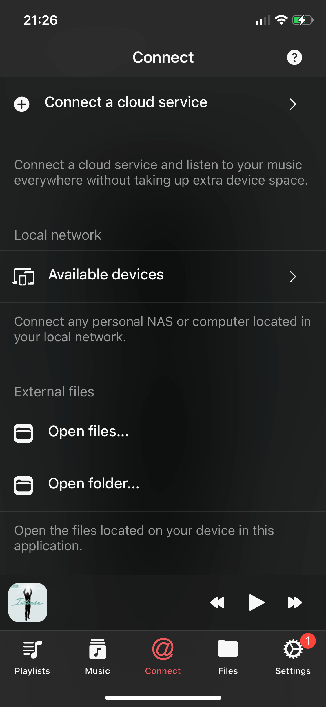
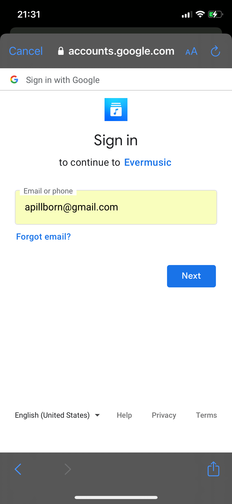
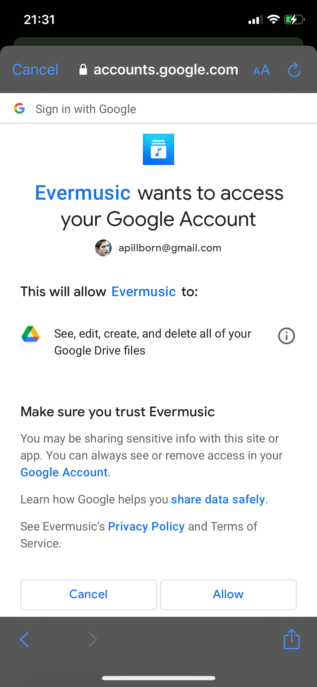
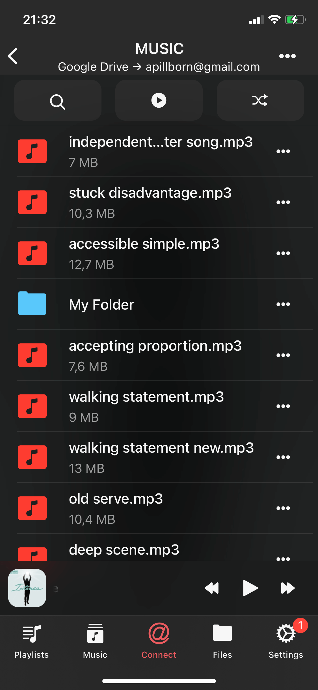

# How to upload my files to the cloud storage and connect them to Evermusic, Flacbox, Evertag

**Writer:** admin  
**Date:** Mar 17, 2022  
**Updated:** Dec 6, 2024  
**Reading Time:** 2 min read

If you have not got an account in one of the cloud services we support, please go to their website to sign up.

You can connect any of the supported accounts: Dropbox, Box, Google Drive, OneDrive, MediaFire, Yandex.Disk, MEGA, SMB, MyDrive, pCloud, HiDrive, WebDAV.

Once you have an account, download the cloud service application for Mac or PC and install it.

Follow the instructions of the cloud service on moving files to the cloud.

Once the upload is complete, you may open one of our apps on the iPhone, iPad, Mac and login to the cloud service to get access to your files.

1. Open the "Connections" tab and tap the "Connect a cloud service" menu item.

2. Select a cloud service from the list of supported services.

3. Enter login and password for that service.

4. Allow access to the files stored on your cloud service.

5. Open the connected cloud service in the app to see cloud files. You can use the built-in file manager to Move, Rename, Delete, and Download your files. Just use the more actions button "..." to see all available actions.

Connecting your cloud service to our apps streamlines file access and management, making it easier than ever to enjoy your files across different devices.

Say goodbye to storage limitations and hello to convenience!

---

**Tags:** evermusic, flacbox, cloud, file, account, manager, connect, network, service

**Category:** How To