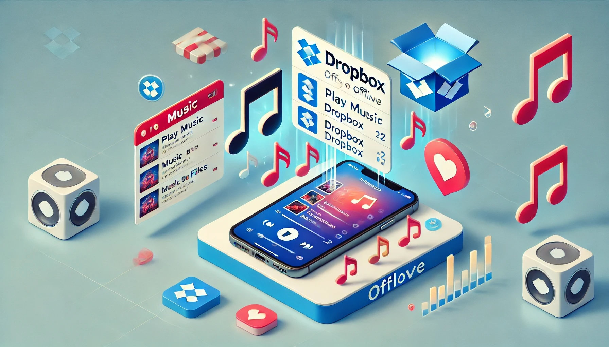
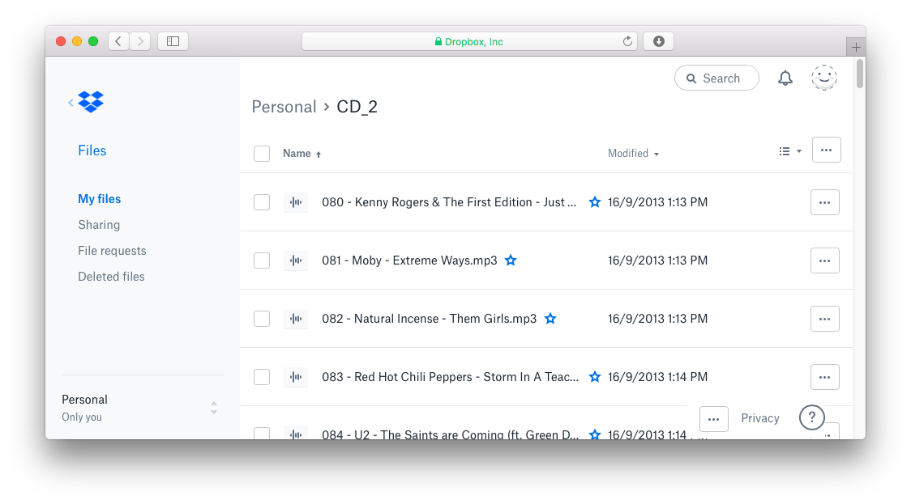
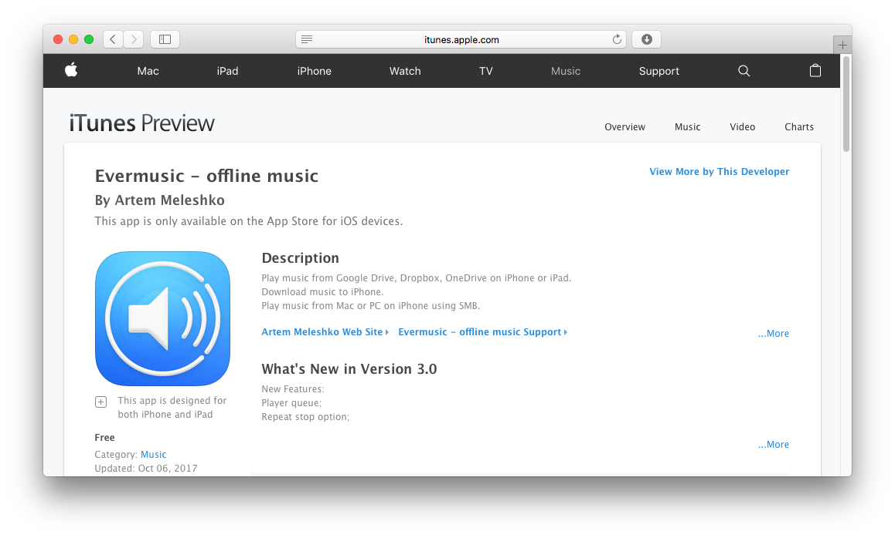

# Play music from Dropbox on your iPhone when you are offline

**Author:** admin  
**Date:** Oct 20, 2017  
**Updated:** Dec 8, 2024  
**Read Time:** 2 min read  

Dropbox is a fantastic cloud storage solution, and it's not just for office files. You can also upload and store your audio content, making it a versatile option for music lovers. Imagine having your meticulously ripped CDs transformed into a vast music library, ready to accompany you wherever you go. With Evermusic, you can turn this dream into a reality.

Evermusic is your all-in-one music player, streamer, downloader, and playlists manager. It empowers you to connect any cloud storage with your audio tracks, providing a seamless music experience akin to your native Music app. Here's how you can unlock the potential of Evermusic and free up valuable space on your device by moving your music to the cloud.

## Move Your Music to the Cloud:

### Upload Your Music:
Start by registering and signing into your Dropbox account using a desktop web browser. Install the Dropbox app on your computer and transfer your audio tracks to the Dropbox folder. It may take some time to sync all your data to the server.

### Install Evermusic App:

**Get Evermusic:**  
Evermusic is absolutely free and available for both iPhone and iPad, compatible with devices running iOS 8.0 or later. You can download it from the App Store:  
[Download Evermusic](https://itunes.apple.com/us/app/evermusic-offline-music/id885367198?mt=8)

### Connect Your Dropbox:
Once Evermusic is installed, open the 'Connections' Tab -> "Connect a cloud service", select Dropbox from the list of available cloud accounts, and add your account. You can authorize your account using the native app or a web form with login and password. Rest assured, this connection is secure, and Evermusic does not have access to your data and account.

### Enjoy Your Music:

**Limitless Music Library:**  
You can connect an unlimited number of accounts. Evermusic scans connected cloud storages for supported audio files (MP3, WAV, and more), and all found files appear in the 'Music Library' Tab. Start playing by tapping on any audio file.

**Enhance Your Listening Experience:**  
Evermusic includes a built-in 10-band equalizer with iPod-style presets, preamplifier, and bass booster. Audiobook lovers will appreciate the audio bookmarks and playback speed features. A sleep timer ensures your music turns off after a selected timeout. Evermusic supports remote controls and music playback on the lock screen. You can also stream your music to Google Chromecast and Apple TV.

### Download for Offline Playback:

**Offline Access:**  
Download your favorite tracks for offline playback by selecting 'Download' in the options menu. There's also a player cache, ensuring all your recently played files can be accessed offline in the Files section. Offline playlists are available too; just enable the 'Available Offline' option for selected playlists.

### Edit Audio Files Like a Pro:

**File Management:**  
Evermusic serves as an excellent file manager, supporting all basic file operations like rename, move, delete, upload, and download. Manage your music library efficiently, remove unused tracks, or eliminate duplicates. There's also an ID3 Tags Editor, making metadata updates a breeze.

And the best part? Evermusic is absolutely free. Designed for iPhone and iPad running iOS 8.0 and later, it's the ultimate solution for music enthusiasts who want to enjoy their music library on the cloud.

Download Evermusic from the App Store now:  
[Get Evermusic](https://itunes.apple.com/us/app/evermusic-offline-music/id885367198?mt=8)

Experience the freedom of cloud-based music streaming with Evermusic and take your music wherever life leads you.

---

**Tags:** [cloud](https://www.everappz.com/blog/tags/cloud), [streaming](https://www.everappz.com/blog/tags/streaming), [iphone](https://www.everappz.com/blog/tags/iphone-1), [mp3](https://www.everappz.com/blog/tags/mp3), [storage](https://www.everappz.com/blog/tags/storage), [dropbox](https://www.everappz.com/blog/tags/dropbox-1)  
**Category:** [How To](https://www.everappz.com/blog/categories/how-to)