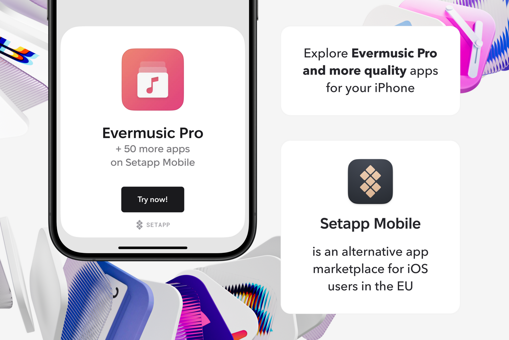

# Setapp Mobile and Evermusic Pro Integration: Unlocking New Possibilities for Music Lovers

**Writer:** admin  
**Date:** Sep 17, 2024  
**Read Time:** 4 min read

The mobile world is constantly evolving, and with it, the ways we manage our media, work, and entertainment. **[Setapp](https://go.setapp.com/stp435?_target=https://www.setapp.com/setapp-mobile&stc=mobile)**, a subscription service providing access to a variety of premium apps, recently launched **[Setapp Mobile](https://go.setapp.com/stp435?_target=https://www.setapp.com/setapp-mobile&stc=mobile)**, bringing its vast app ecosystem to iOS users. One of the standout integrations within Setapp Mobile is with **[Evermusic Pro](https://go.setapp.com/stp435?_target=https://www.setapp.com/setapp-mobile&stc=mobile)**, an all-in-one music player and cloud storage manager.

In this post, we’ll explore the exciting benefits of Setapp Mobile’s integration with Evermusic Pro and how this collaboration can enhance your music experience.

## What is Setapp Mobile?

For those unfamiliar, **[Setapp](https://go.setapp.com/stp435?_target=https://www.setapp.com/setapp-mobile&stc=mobile)** is a subscription platform that provides users with access to over 240 premium Mac and iOS apps for a flat monthly fee. **[Setapp Mobile](https://go.setapp.com/stp435?_target=https://www.setapp.com/setapp-mobile&stc=mobile)** extends this service to iPhone and iPad users, offering curated, high-quality apps that cover productivity, creativity, media, and more. With Setapp, users can avoid in-app purchases or individual app subscriptions, getting access to a range of tools they can rely on for their everyday tasks.

## Meet Evermusic Pro: Your Ultimate Music Manager

**Evermusic Pro** is a feature-rich app designed for audiophiles and music enthusiasts alike. This powerful music player allows you to manage and stream your audio library directly from cloud services such as **Google Drive, Dropbox, OneDrive, iCloud, and more**. If you’re tired of juggling multiple music apps or local storage limitations, Evermusic Pro offers a seamless way to enjoy your music anywhere, anytime.

**Key features of Evermusic Pro** include:

- Cloud storage integration
- Offline playback for your favorite tracks
- A built-in equalizer and bass booster
- Support for various audio formats (MP3, FLAC, AAC, etc.)
- Metadata editor for organizing your library
- Playlist management and sorting options

## How Setapp Mobile and Evermusic Pro Integration Benefits You

The integration of Evermusic Pro with **[Setapp Mobile](https://go.setapp.com/stp435?_target=https://www.setapp.com/setapp-mobile&stc=mobile)** opens up a world of convenience and expanded functionality for music lovers. Here’s how it can elevate your music experience:

1. **Unified Subscription, No Hidden Costs**  
   With Setapp Mobile, you don’t need to worry about purchasing Evermusic Pro separately or dealing with in-app purchases. The subscription model provides full access to the app without additional fees. This is perfect for users who want a hassle-free way to enjoy premium apps like Evermusic Pro, while also benefiting from other productivity or creativity tools available through Setapp.

2. **All Your Music in One Place**  
   Evermusic Pro allows you to link your cloud storage accounts and create a unified music library. Whether you have tracks saved in Dropbox, Google Drive, or even your own NAS device, Evermusic Pro ensures all your music is accessible through one easy-to-navigate interface. No more switching between apps to find that specific song or album—it’s all in one place.

3. **Offline Listening for On-the-Go**  
   Setapp Mobile users will appreciate Evermusic Pro’s ability to **download music for offline listening**. Simply choose the tracks or albums you want, and you’re good to go—whether you’re traveling, working out, or just away from a reliable internet connection. The offline mode ensures you always have your music on hand, even without using data.

4. **High-Quality Audio Control**  
   Music lovers know that audio quality makes all the difference. Evermusic Pro offers a **built-in equalizer** and **bass booster**, giving you control over your sound preferences. Whether you’re into classical, hip-hop, or electronic music, you can tweak the audio settings to get the best listening experience, personalized for your ears.

5. **Cloud Storage Flexibility**  
   One of Evermusic Pro’s standout features is its **cloud storage integration**. You can use popular services like iCloud, OneDrive, Dropbox, or even connect to **NAS devices** for more advanced users. This level of flexibility means that you don’t have to worry about storage space on your iPhone—just stream directly from your cloud, and save only what you need offline.

## Why This Integration is a Game-Changer

The Setapp Mobile and Evermusic Pro integration is a win-win for users who want more from their mobile music experience. Here’s why:

- **Cost Efficiency**: Setapp’s unified subscription model means you’re not paying for individual apps or dealing with pesky ads and microtransactions. You get premium features at a predictable cost.
- **Simplicity**: Evermusic Pro’s user-friendly interface makes managing your cloud-based music library effortless, and with Setapp Mobile, all your apps are centralized in one ecosystem.
- **Customization and Control**: The built-in equalizer and support for high-quality audio formats allow for a tailored listening experience, while the cloud integration means you never run out of space for your music.

## Conclusion

For iPhone and iPad users, Setapp Mobile and Evermusic Pro’s integration offers the perfect blend of convenience, functionality, and value. Whether you’re a casual listener or a dedicated audiophile, this collaboration makes managing and enjoying your music collection easier than ever before. With Setapp’s growing library of apps, you can continue to expand your mobile toolkit while knowing that powerful apps like Evermusic Pro are just a tap away.

If you haven’t already explored Setapp Mobile, now is the perfect time to dive in and unlock the full potential of Evermusic Pro, along with a range of other incredible apps at your fingertips.

**[Explore Setapp Mobile and Evermusic Pro Today](https://go.setapp.com/stp435?_target=https://www.setapp.com/setapp-mobile&stc=mobile)**

---

**Tags:** [evermusic](https://www.everappz.com/blog/tags/evermusic), [setapp](https://www.everappz.com/blog/tags/setapp), [mobile](https://www.everappz.com/blog/tags/_mobile), [marketplace](https://www.everappz.com/blog/tags/marketplace), [eu](https://www.everappz.com/blog/tags/eu)

**Categories:** [What's New](https://www.everappz.com/blog/categories/what-s-new), [Choosing the Best](https://www.everappz.com/blog/categories/choosing-the-best)