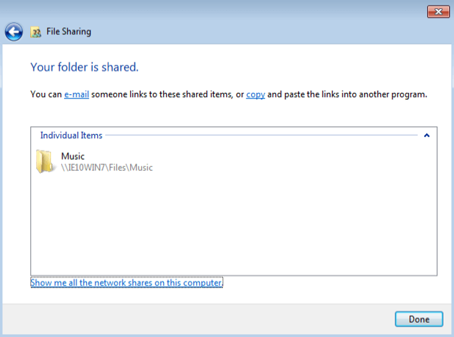
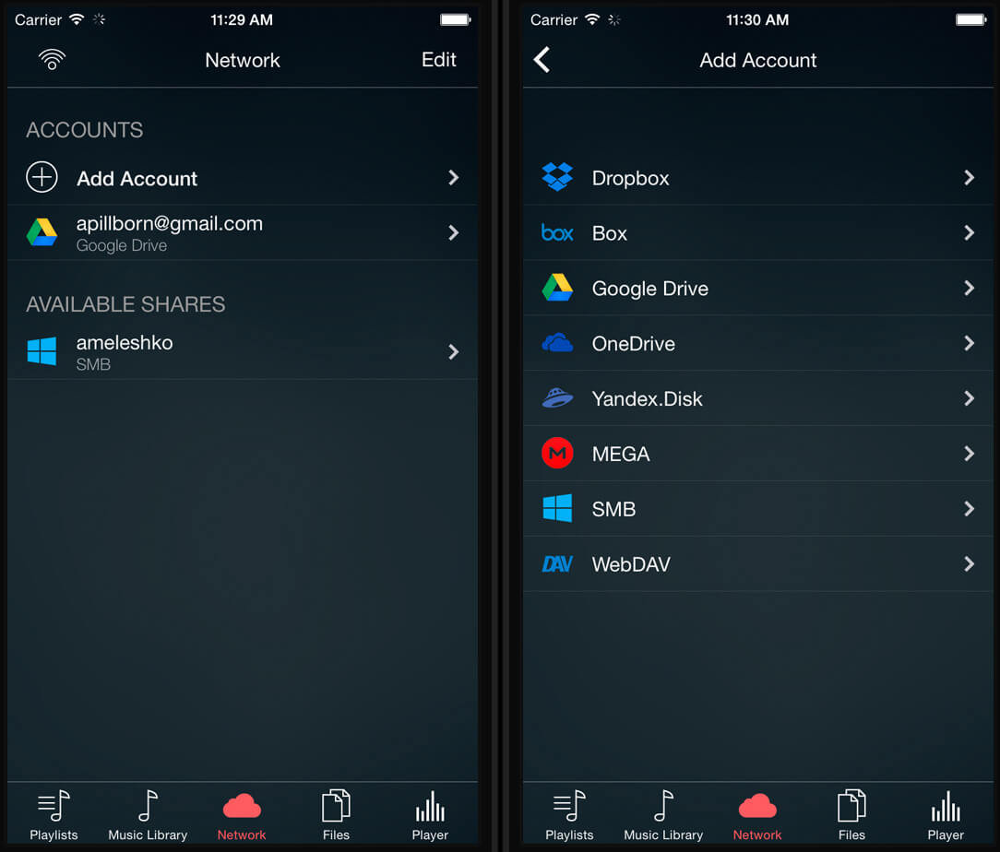
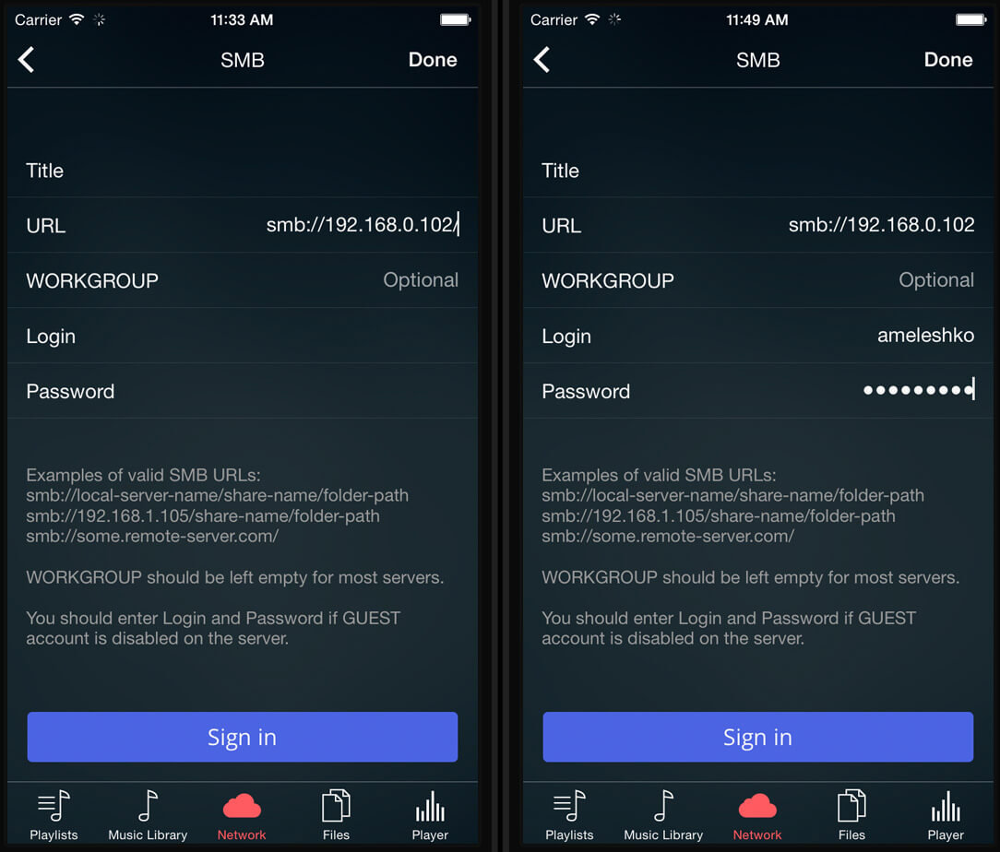
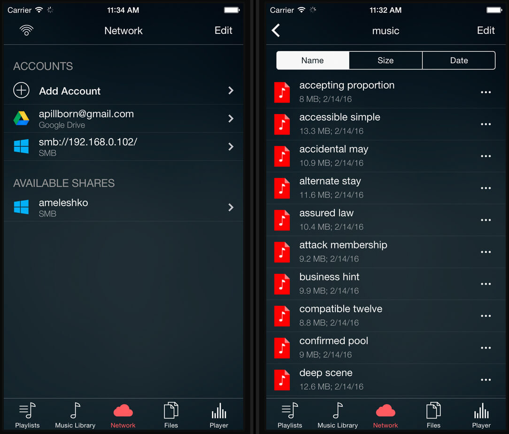
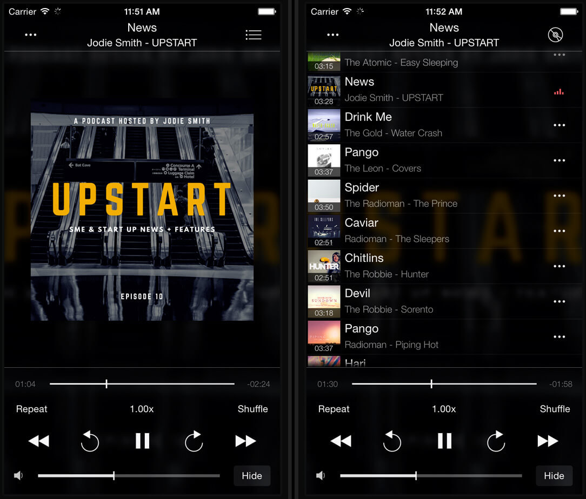

# Stream your music from MAC or PC to iPhone using SMB

**Writer:** admin  
**Date:** May 29, 2016  
**Updated:** Jul 28, 2024  
**Read Time:** 3 min read

Are you drowning in a sea of music on your MAC or PC and want to enjoy it hassle-free on your iPhone or iPad? Look no further than Evermusic. With Evermusic, it's incredibly simple to connect your computer using the SMB protocol and stream your beloved tunes without worrying about taking up extra device space or dealing with synchronization hassles. Here's a step-by-step guide to get you started:

## Step 1: Enable SMB Protocol on Your Computer


### On your MAC:

- Open System Preferences -> Sharing.
- Enable the File Sharing service.
- In the "Shared Folders" section, add your music folder, select a user, and set permission levels (Read & Write or Read Only).
- For added convenience, you can select "Everyone: Read Only" for the music folder, making it easily accessible in Evermusic.
- Don't forget to remember your computer's URL (smb://192.168.xx.xx) for the next steps.


- Tap "Options" and enable "Share files and folders using SMB."
- Enable "Windows File Sharing" for available accounts.


### If you're using a Windows PC:


- Right-click on your music folder.
- Select "Properties."
- Open the "Sharing" tab.
- Click "Share…"
- Choose the people to share with and set their permission levels.
- Like with MAC, you can opt for "Everyone: Read" for the selected music folder.
- Click "Done" to save your settings.



## Step 2: Open Evermusic

- Now, open Evermusic and go to the "Connections" tab ("Network" if you are using old app version).
- If you see your computer in the "Available devices" ("Available shares" if you are using old app version) section and selected "Anyone: Read Only" in the previous step, simply tap on your computer, and it will connect automatically.
- If this doesn't happen, you can add your computer manually.



## Step 3: Add Your Computer Manually

- Tap "Connect a cloud service" ("Add Account" if you are using old app version)
- Select "SMB" from the list of available servers on the next screen.
- In the "SMB" Settings screen:
  - Enter the server URL with the shared folder path. You may enter the server name or server IP. For example:
  
    ```
    smb://ameleshko.local/Music/
    smb://192.168.0.102/Music/
    smb://192.168.0.102/
    ```
  
  - Enter your Login and Password or leave these fields blank if you selected "Anyone: Read Only" in the previous step.
  - The "WORKGROUP" field is optional and should be used if you have an Active Directory Domain.



Once you've connected your SMB Account, it will appear in the "Cloud services"("Accounts") section. Open the connected account by tapping on it, navigate to the music folder, and tap on any audio file to start the player.



Enjoy your music collection seamlessly on your iPhone or iPad with Evermusic.



### SMB2 Workaround

If you encounter issues with browsing folders or playing files that contain special symbols (like ü, ö, é), this may be related to the SMB2 protocol. We are actively working on resolving this issue.

As a temporary solution, please try enabling SMB 1 on your server and in the app settings. Alternatively, you can connect to your SMB server using the system file open menu. Here's how:

1. Navigate to "Local files."
2. Scroll down to the "Files on this device" section and tap "Open files..." or "Open folders..."
3. Locate your server and select the files or folders you need.
4. Tap "Open" to confirm your selection.

Additionally, you can try connecting to your NAS using WebDAV or DLNA protocols if supported.

By following these steps, you can bypass the issues related to special symbols in file names and continue enjoying your media files.

P.S. You can also transfer audio files from your MAC/PC to your iPhone using iTunes File Sharing and play local audio files. Learn more about this feature in our guide: "[How To Play iTunes Files on iPhone](https://www.everappz.com/post/how-to-play-local-itunes-files-on-my-iphone)."

---

### Tags:
[cloud](https://www.everappz.com/blog/tags/cloud), [streaming](https://www.everappz.com/blog/tags/streaming), [computer](https://www.everappz.com/blog/tags/computer), [mp3](https://www.everappz.com/blog/tags/mp3), [file](https://www.everappz.com/blog/tags/file), [downloader](https://www.everappz.com/blog/tags/downloader), [manager](https://www.everappz.com/blog/tags/manager), [pc](https://www.everappz.com/blog/tags/pc), [mac](https://www.everappz.com/blog/tags/mac), [sharing](https://www.everappz.com/blog/tags/sharing), [windows](https://www.everappz.com/blog/tags/windows), [smb](https://www.everappz.com/blog/tags/smb)

### Categories:
[How To](https://www.everappz.com/blog/categories/how-to)