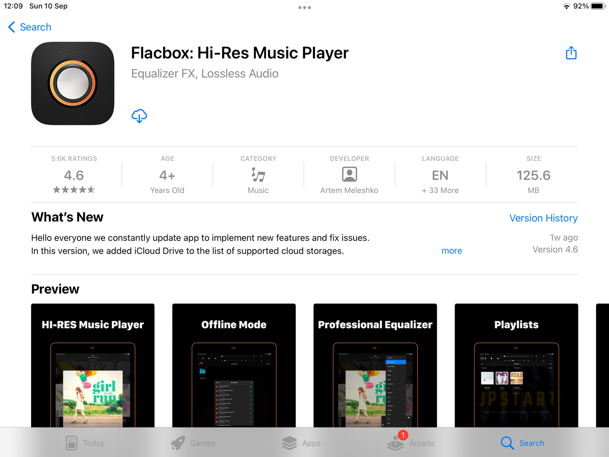
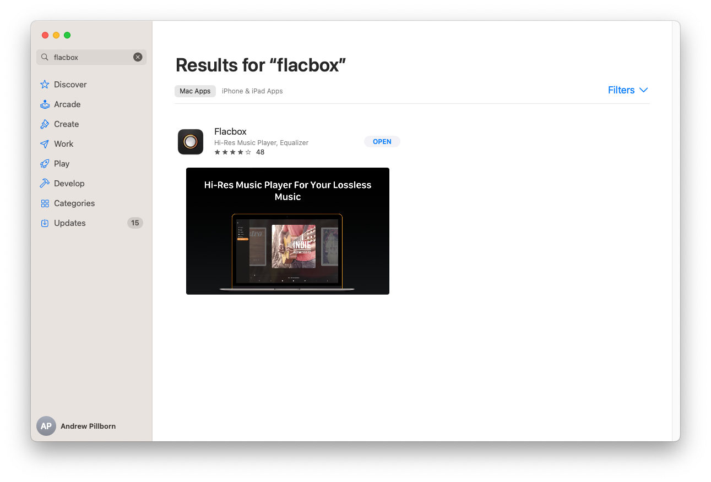

# Unleash Audiophile Bliss: Playing Lossless Music on iPhone or Mac with Flacbox

**Apr 5, 2020**  
**Updated: Dec 6, 2024**  
**3 min read**

For the true audiophiles among us, music isn't just something we listen to; it's an experience we immerse ourselves in, with every note, every nuance, and every instrument brought to life in exquisite detail. If you're passionate about high-quality, lossless music, you're in the right place. In this guide, we'll show you how to elevate your music-listening experience on your iPhone or Mac using the powerful Flacbox app.

## Why Lossless Music Matters

Before we dive into the technicalities, let's understand why lossless music is worth the effort. Lossless audio files, such as FLAC (Free Lossless Audio Codec) and DSD (Direct Stream Digital), offer audio quality that's virtually indistinguishable from the original studio recordings. They capture the full range of sound and deliver it to your ears with unparalleled clarity.

To fully appreciate the depth and richness of lossless music, you need the right tools, and Flacbox is the perfect companion for your journey into high-fidelity audio.

## Getting Started with Flacbox

Flacbox is a versatile app available for both iOS and macOS that specializes in playing lossless music files. Here's how to get started:

### For iOS:

**Download Flacbox**: Head to the App Store on your iPhone or iPad and search for "Flacbox." Download and install the app.

**Import Your Music**: Once you've installed Flacbox, you'll need to import your lossless music files. You can do this through iTunes File Sharing, Wi-Fi transfer, or cloud storage services like iCloud Drive or Dropbox. Flacbox supports various lossless formats, including FLAC, DSD, and more.

**Organize Your Library**: Flacbox allows you to organize your music library by artist, album, genre, and more, ensuring easy access to your favorite tunes.

### For macOS:

**Download Flacbox**: Visit the Mac App Store and search for "Flacbox." Download and install the app on your Mac.

**Import Your Music**: Similar to the iOS version, you can import your lossless music files into Flacbox on your Mac. You can also access files directly from your local storage or external drives.

**Create Playlists**: Flacbox for macOS enables you to create playlists, making it convenient to queue up your preferred tracks for seamless listening.

## Enjoying Lossless Music with Flacbox

Once you've imported your lossless music into Flacbox, the app provides an immersive audio experience tailored to audiophiles. Here's how to make the most of it:

### On iOS:

**Navigation**: Use Flacbox's intuitive interface to browse your music library by artist, album, genre, or any other classification that suits your preference.

**Customization**: Flacbox allows you to fine-tune your listening experience with an equalizer, allowing you to adjust the audio settings to your liking.

**High-Resolution Audio**: The app supports high-resolution audio up to 24-bit, ensuring that you experience your music in its purest form.

### On macOS:

**Playback Control**: Flacbox on macOS offers comprehensive playback control, including play, pause, skip, shuffle, and repeat options.

**Metadata Editing**: You can edit metadata within the app to ensure your music collection is well-organized.

**Playlist Management**: Create and manage playlists effortlessly, so you can curate the perfect listening experience for any occasion.

## Tips for Optimal Listening

To truly optimize your lossless music experience with Flacbox, consider the following tips:

**Invest in Quality Headphones or Speakers**: To appreciate the full spectrum of lossless music, quality audio output is crucial. Invest in high-end headphones or speakers for the best results.

**Store Your Music Safely**: Ensure your lossless music files are stored securely to prevent any data loss. Back them up regularly to avoid any unfortunate mishaps.

**Explore High-Resolution Audio**: Many audiophiles also seek out high-resolution audio tracks. Flacbox supports these formats, so make sure to explore them for an even richer listening experience.

**Stay Organized**: Keep your music library organized within Flacbox. Properly labeled files and organized playlists make it easier to find and enjoy your favorite tunes.

In conclusion, Flacbox is your ticket to audio nirvana on both iPhone and Mac. With its support for lossless audio formats, intuitive interface, and powerful customization options, it's a must-have app for any audiophile. So, start exploring your music collection in stunning detail, and let Flacbox take your listening experience to new heights.

As you embark on your lossless music journey with Flacbox, remember that quality audio deserves quality equipment. Invest in a pair of excellent headphones or speakers, sit back, and let the magic of lossless music transport you to a world of sound like never before. Your ears will thank you.

---

**Tags:** [music](https://www.everappz.com/blog/tags/music), [flacbox](https://www.everappz.com/blog/tags/flacbox), [audio](https://www.everappz.com/blog/tags/audio), [computer](https://www.everappz.com/blog/tags/computer), [lossless](https://www.everappz.com/blog/tags/lossless)

**Category:** [Choosing the Best](https://www.everappz.com/blog/categories/choosing-the-best)