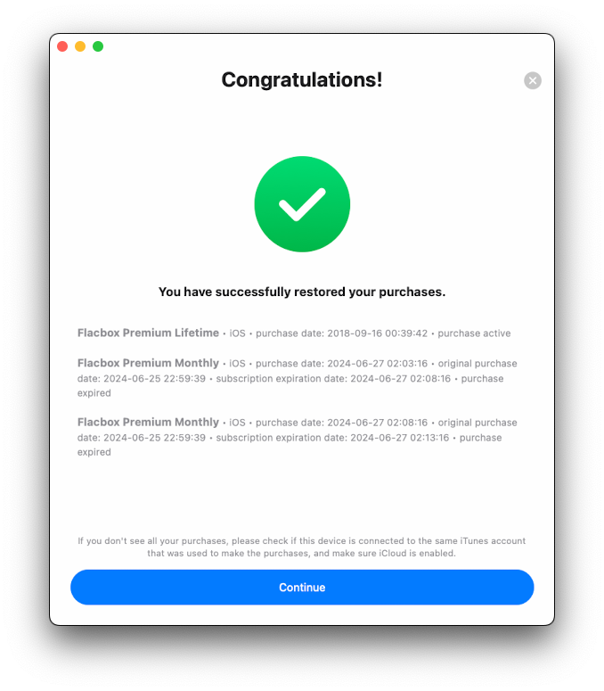

# What is the difference between Flacbox and Flacbox Premium?

**Writer:** admin  
**Date:** Jan 3, 2020  
**Updated:** Dec 8, 2024  
**Reading Time:** 3 min read

Flacbox offers both a free version with certain usage limitations and a premium version with added features, which can be unlocked through in-app purchases.

The free version of the application offers a one-time lifetime in-app purchase and two subscription options (1 month and 1 year) to remove all restrictions and upgrade to the Premium version, allowing you to choose the best and most optimal price for you. Prices may vary depending on your country or territory. Also, please keep in mind that **Family Sharing** is enabled for all purchases and plans, so you can share the Premium version with members of your family.

**Sharing Purchases Between iOS and Mac:**  
Lifetime purchases and subscriptions are shared between iOS and Mac, using iCloud to sync this information. If you have the premium version on your iOS device, please ensure you have the latest version installed and that iCloud is enabled. Start the app on iOS and wait one minute for your purchase information to upload to iCloud.

You can also try pressing the "Restore Purchases" button in the app settings. Afterward, install the latest app version from the App Store on your Mac and start the app. Ensure you have an internet connection and are using the same iCloud and App Store account on your Mac that you used on your iOS device. Wait one minute for the app to download purchase info from iCloud. The premium version should activate on your Mac automatically.

**Restore on a New iOS Device:**  
To restore your purchase on the new device just use the "Restore purchases" menu. You will see the list of your purchases. If you don't see all your purchases please check if the device is connected to the same iTunes account that was used to make purchases, and make sure iCloud is enabled.

Once you upgrade your app, you will see the Premium status screen with details of your current purchases.

Additionally, there's a limited-time opportunity to "**Try Premium for Free**". You can access this feature through the "Try Premium for Free" menu. By simply watching an advertisement or spreading the word about the app to your friends, you can unlock the Premium version for free during this promotional period. This provides you with a chance to experience the premium features without any financial commitment.

## Flacbox Free:

- Contains ads, occasionally interrupting your music listening.
- Allows the creation of up to 10 playlists.
- Supports up to 3 cloud services.
- Limits you to adding a maximum of 100 songs to your favorites.
- Places restrictions on playlists (up to 1,000 songs) and the player queue (up to 750 songs).
- Offers limited offline features, including just 1 offline folder and the ability to download albums, artists, genres, playlists, and composers for offline listening.
- Offers 20 automatic tag search requests per day.
- Offers 20 album art search requests per day.
- Allows 5 media collections (playlists, albums, artists, genres) exports to m3u/csv/txt per day.

## Flacbox Premium:

- Provides an ad-free music listening experience.
- Allows you to create an unlimited number of playlists.
- Offers the flexibility to connect to an unlimited number of cloud services, expanding your music library access.
- Lets you add an unlimited number of songs to your favorites.
- Removes limitations on playlist and queue size, giving you more control over music organization.
- Offers extensive offline capabilities, allowing you to download folders, albums, artists, genres, playlists, and composers for offline listening.
- Offers unlimited automatic tag search requests.
- Offers unlimited album art search requests.
- Allows unlimited media collections (playlists, albums, artists, genres) exports to m3u/csv/txt.

Here's a side-by-side comparison:

| Feature                                    | Flacbox Free | Flacbox Premium |
|--------------------------------------------|--------------|-----------------|
| No ads                                     | No           | Yes             |
| Offline folders                            | 1            | Unlimited       |
| Maximum number of playlists                | 10           | Unlimited       |
| Maximum number of cloud services           | 3            | Unlimited       |
| Maximum number of favorites                | 100          | Unlimited       |
| Maximum number of songs in one playlist    | 1000         | Unlimited       |
| Maximum number of songs in a player queue  | 750          | Unlimited       |
| Download and upload folders                | No           | Yes             |
| Download albums, artists, genres           | No           | Yes             |
| Offline albums, artists, genres, playlists | 1            | Unlimited       |
| Automatic tag search requests per day      | 20           | Unlimited       |
| Album art search requests per day          | 20           | Unlimited       |
| Media collections export to M3U/CSV/TXT    | 5            | Unlimited       |

## What to choose?

In summary, Flacbox Premium offers an enhanced music player experience with more features, an ad-free environment, and extensive offline access. Whether you choose the free version or the premium one depends on your specific music listening needs and preferences.

**Tags:** [flacbox](https://www.everappz.com/blog/tags/flacbox), [premium](https://www.everappz.com/blog/tags/premium), [upgrade](https://www.everappz.com/blog/tags/upgrade), [purchase](https://www.everappz.com/blog/tags/purchase)  
**Category:** [Choosing the Best](https://www.everappz.com/blog/categories/choosing-the-best)